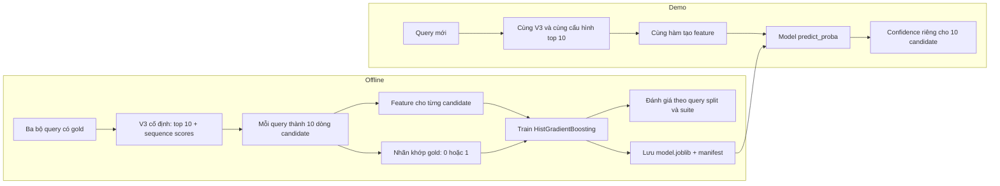

# ReparoS Base V3: cách tính và phục vụ candidate confidence

## 1. Confidence ở đây có nghĩa gì?

Với truy vấn `q`, Base V3 sinh 10 câu sửa `c₁ … c₁₀`. Bộ confidence hiện tại trả về một số riêng cho từng câu:

`pᵢ = P(cᵢ khớp câu gold | q, cᵢ, điểm và thứ hạng của 10 câu do V3 sinh)`.

Trong tài liệu này, **khớp gold** có nghĩa là so sánh văn bản sau khi chuẩn hóa Unicode NFC và khoảng trắng. Viết hoa, dấu câu và nội dung khác vẫn được giữ để so sánh. Đây là đúng nhãn `strict_exact_labels` trong dữ liệu. Một câu sửa hợp lý nhưng khác cách viết câu gold sẽ nhận nhãn 0. Confidence này không đo độ gần người dùng, mức liên quan của kết quả search, hay xác suất toàn bộ pipeline trả đúng địa điểm.

10 giá trị `pᵢ` là 10 dự đoán nhị phân riêng. Chúng **không cần cộng thành 100%**. Điểm CTranslate2 `sequence_scores` cũng không phải xác suất đúng; chúng chỉ là đầu vào cho bộ dự đoán confidence.

## 2. Toàn bộ luồng hiện có



Luồng này **không gọi LLM**. Margin `s₁−s₂` hiện được dùng như một feature của bộ dự đoán, không dùng để tự động nhờ LLM gán nhãn. Hướng chọn query theo margin rồi nhờ LLM hỗ trợ tạo nhãn là một ý tưởng bổ sung dữ liệu về sau, chưa nằm trong code này.

## 3. Đầu vào để train được tạo như thế nào?

### 3.1. Nguồn query và gold

Script [`build_reparos_base_v3_confidence_data.py`](../scripts/build_reparos_base_v3_confidence_data.py) đọc `gold.jsonl` của ba suite:

| Suite | Query |
|---|---:|
| `reparos-diagnostic-10k` | 10.000 |
| `reparos-compositional-4k` | 4.000 |
| `reparos-user-centric-v2` | 88 |
| **Tổng** | **14.088** |

Mỗi bản ghi cần tối thiểu `input` (query lỗi của người dùng) và `expected` (câu gold). Khi serve không có `expected`; trường này chỉ dùng lúc chuẩn bị nhãn và chia dữ liệu.

### 3.2. Chạy checkpoint V3 cố định

Script dùng CTranslate2 export ở:

`artifacts/reparos_base_v3_production_checkpoints/checkpoints/base_v3_production/ctranslate2_export`

Input được đưa trực tiếp vào SentencePiece, **không chuyển chữ thường**. Cấu hình tạo dữ liệu là CPU, `compute_type=default`, `beam_size=10`, `num_hypotheses=10`, CTranslate2 `length_penalty=0.0`, không thêm repetition penalty. Hash của `model.bin` và tokenizer được ghi trong [`manifest.json`](../artifacts/reparos_base_v3_confidence_14088/manifest.json); thay checkpoint hay cách decode có thể làm phân phối score thay đổi và phải đánh giá lại confidence.

Mỗi query cho ra 10 `hypotheses` và 10 `sequence_scores`. File kết quả là [`top10_predictions.jsonl`](../artifacts/reparos_base_v3_confidence_14088/top10_predictions.jsonl). Các trường chính:

```json
{
  "input": "hem 112 chien thang",
  "expected": "hẻm 112 chiến thắng",
  "hypotheses": ["hẻm 112 chiến thắng", "hèm 112 chiến thắng", "..."],
  "sequence_scores": [-0.00016, -9.39073, "..."],
  "strict_exact_labels": [1, 0, "..."]
}
```

Ví dụ đã rút gọn; file thật có đúng 10 phần tử trong ba mảng cuối. Nhãn được tạo bằng `int(normalize(candidate) == normalize(expected))`. Tổng cộng có **140.880 dòng candidate**, trong đó 11.994 dòng khớp gold. Một query vẫn có thể không có candidate nào khớp gold.

## 4. Một candidate được biến thành feature ra sao?

Với query `q`, 10 candidate `c₁ … c₁₀` và score đã xếp theo thứ hạng `s₁ … s₁₀`, hàm [`candidate_feature_rows`](../scripts/reparos_confidence_features.py) tạo ma trận **10 hàng × 27 cột**. Hàng thứ `i` chỉ mô tả candidate `cᵢ` trong bối cảnh query và cả danh sách top 10. Không có câu gold trong feature.

| Nhóm | Feature | Cách hiểu |
|---|---|---|
| Score | `sequence_score` | `sᵢ`, điểm V3 gán cho candidate này |
| Khoảng cách | `gap_from_top_score` | `s₁−sᵢ`; top 1 có giá trị 0 |
| Margin query | `top1_top2_margin` | `s₁−s₂`; giống nhau trên 10 hàng của cùng query |
| Thay đổi văn bản | `character_change_ratio` | `1 − SequenceMatcher(q,cᵢ).ratio()` |
| Độ dài | `relative_length_change` | `(len(cᵢ)−len(q))/max(len(q),1)` |
| Giữ nguyên input | `unchanged_input` | 1 nếu candidate bằng input sau chuẩn hóa NFC/khoảng trắng |
| Độ dài input | `input_length` | Số ký tự query sau chuẩn hóa |
| Thứ hạng | `rank_1` … `rank_10` | 10 cột one-hot: chỉ cột ứng với rank hiện tại bằng 1 |
| Biến đổi score | `log1p_margin`, `log1p_gap`, `score_squared` | Biến đổi phi tuyến của margin, gap và `sᵢ` |
| Khoảng cách lân cận | `gap_to_next`, `gap_from_previous` | Khoảng cách score với candidate kế tiếp hoặc trước đó; biên bằng 0 |
| Tương tác rank | `margin_x_rank1`, `margin_x_rank2`, `change_x_rank1`, `score_x_rank1` | Cho phép quan hệ khác nhau ở rank 1 và 2 |
| Thay đổi khi bỏ dấu | `accent_fold_change` | So sánh input/candidate sau khi bỏ dấu tiếng Việt |

Ví dụ `s₁=-2`, `s₂=-3`, `s₃=-5`: feature `s₁−sᵢ` của ba candidate lần lượt là `0, 1, 3`; feature `s₁−s₂` đều là `1`. **Không lấy `s₁−s₂` làm confidence cuối.** Model học từ các feature và nhãn để dự đoán `pᵢ`.

## 5. Chia dữ liệu và train model

### 5.1. Cách chia

Script [`compare_reparos_confidence_methods.py`](../scripts/compare_reparos_confidence_methods.py) dùng SHA-256 với seed `7193` trên câu `expected` đã chuẩn hóa để chia theo **nhóm gold**, không chia ngẫu nhiên từng dòng candidate. Mọi candidate của một query và những query có cùng gold chuẩn hóa ở chung một phía:

| Phần | Query | Dòng candidate | Công dụng |
|---|---:|---:|---|
| Development | 11.021 | 110.210 | So sánh mô hình bằng 5 fold CV rồi fit model demo |
| Test | 3.067 | 30.670 | Đánh giá cùng phân phối trong ba suite |

Trong development, 5 fold cũng được gán theo nhóm gold. Test không được dùng để fit artifact trong demo. Tuy nhiên kết quả test của các thử nghiệm trước đã được xem khi mở rộng so sánh mô hình, nên phép so sánh hiện tại là **thăm dò**, không phải blind test mới.

### 5.2. Các mô hình đã thử

Baseline là **logistic regression** dùng 27 feature; script hiện thực tối ưu Newton có regularization L2. Sau đó thử `HistGradientBoostingClassifier` với hai cấu hình và `RandomForestClassifier` trên cùng nhãn, feature, split và metric. Script so sánh: [`compare_reparos_nonlinear_confidence.py`](../scripts/compare_reparos_nonlinear_confidence.py).

Model đang được demo dùng là **HistGradientBoostingClassifier `hgb_deep`** của scikit-learn:

```text
max_iter=160
max_leaf_nodes=31
min_samples_leaf=40
l2_regularization=2.0
learning_rate=0.05
early_stopping=False
random_state=7193
```

Script [`export_reparos_demo_confidence.py`](../scripts/export_reparos_demo_confidence.py) đọc lại 11.021 query development, tạo feature bằng hàm dùng trong demo, fit `hgb_deep` rồi lưu [`model.joblib`](../artifacts/reparos_base_v3_confidence_14088/demo_hgb_deep/model.joblib) và [`manifest.json`](../artifacts/reparos_base_v3_confidence_14088/demo_hgb_deep/manifest.json). Manifest ghi danh sách và thứ tự feature, hash input, hash checkpoint/tokenizer, cấu hình decode và scikit-learn `1.9.1`. Demo từ chối nạp model nếu hash V3, feature hoặc phiên bản scikit-learn không khớp.

**Hiện chưa áp dụng bộ hiệu chỉnh xác suất riêng cho `hgb_deep`.** Giá trị hiển thị là `predict_proba` trực tiếp của model cây.

## 6. Kết quả thực nghiệm

Brier score và ECE càng thấp càng tốt. Brier đo sai số bình phương giữa xác suất dự đoán và nhãn 0/1. ECE10 chia dự đoán thành 10 khoảng xác suất rồi cộng sai lệch giữa xác suất trung bình và tỷ lệ khớp gold thực tế, có trọng số theo số dòng. Vì rank 2–10 có ít nhãn 1, cần xem **top 1 riêng**, không chỉ nhìn chỉ số gộp của 10 candidate.

| Mô hình | CV Brier, top 10 | Test Brier, top 10 | Test Brier, top 1 | Test ECE10, top 1 |
|---|---:|---:|---:|---:|
| Logistic, 27 feature | 0,03130 | 0,03182 | 0,16905 | 0,06712 |
| HistGradientBoosting shallow | 0,02878 | 0,02954 | 0,14680 | **0,04829** |
| **HistGradientBoosting deep — demo** | **0,02844** | **0,02889** | **0,14252** | 0,06117 |
| RandomForest | 0,02988 | 0,02972 | 0,14705 | 0,05727 |

Trên 3.067 query test, tỷ lệ top 1 khớp gold thực tế là **67,75%**. Model `hgb_deep` dự đoán trung bình **63,24%** cho top 1: vẫn thấp hơn thực tế khoảng **4,51 điểm phần trăm**. Brier của top 1 cải thiện so với logistic, nhưng xác suất chưa được hiệu chỉnh hoàn toàn.

Để xem khả năng chuyển sang loại query khác, đã làm phép thử **leave-one-suite-out**: train trên hai suite, bỏ các gold trùng, rồi đánh giá trên suite còn lại. `hgb_deep` có Brier gộp tốt hơn logistic một chút trên compositional-4k (`0,03813` so với `0,03822`), nhưng kém hơn trên diagnostic-10k (`0,03928` so với `0,03827`) và user-centric-v2 (`0,03754` so với `0,03704`). Vì vậy bằng chứng hiện tại chỉ cho thấy cải thiện rõ trên split cùng phân phối; **chưa chứng minh model cây bao quát query mới tốt hơn logistic**. User-centric-v2 chỉ có 88 query, nên số của suite này cũng dễ dao động.

Số liệu đầy đủ nằm trong [`comparison.md` của ba mô hình](../artifacts/reparos_base_v3_confidence_14088/nonlinear_confidence/comparison.md) và [`comparison.md` chuyển suite](../artifacts/reparos_base_v3_confidence_14088/nonlinear_confidence_transfer/comparison.md).

## 7. Serve trong demo

Trong [`demo/streamlit_app.py`](../demo/streamlit_app.py), với mỗi query mới:

1. Chạy đúng checkpoint V3 trong manifest, input nguyên bản, `beam_size=10`, lấy 10 câu và `return_scores=True`.
2. Gọi `candidate_feature_rows(query, hypotheses, scores)` để tạo 10 hàng × 27 cột, đúng thứ tự lúc train.
3. Gọi `confidence_model.predict_proba(feature_rows)[:, 1]` để lấy 10 giá trị `confidence_gold_exact`.
4. Hiển thị xác suất bên cạnh raw score của từng candidate; top 1 có điểm riêng của nó. Demo không gọi LLM và không cần câu gold khi serve.

Để giữ đúng phân phối feature, demo khóa cấu hình decode của V3. Beam size và compute type trong sidebar chỉ áp dụng cho V2. Confidence hiện **không rerank** danh sách và **chưa ghép search score/vị trí**.

## 8. Chạy lại từ đầu

Các lệnh dưới đây chạy tại thư mục gốc dự án trên Windows, dùng venv đã có đủ `numpy`, `scikit-learn`, CTranslate2 và SentencePiece. Việc tạo top 10 cần checkpoint V3 tại đường dẫn ở mục 3.2.

```powershell
& '.venv\Scripts\python.exe' 'scripts\build_reparos_base_v3_confidence_data.py'
& '.venv\Scripts\python.exe' 'scripts\compare_reparos_confidence_methods.py'
& '.venv\Scripts\python.exe' 'scripts\compare_reparos_nonlinear_confidence.py'
& '.venv\Scripts\python.exe' 'scripts\export_reparos_demo_confidence.py'
& '.venv\Scripts\streamlit.exe' run 'demo\streamlit_app.py'
```

File top 10 và manifest dữ liệu là nguồn để tái lập kết quả. Mỗi khi đổi checkpoint V3, tokenizer, cách tiền xử lý, decode hoặc thứ tự feature, phải tạo lại dữ liệu, train lại và đánh giá lại trước khi dùng điểm confidence mới.

## 9. Phạm vi áp dụng kết quả

- Nhãn hiện tại là **khớp gold chính xác**, không phải nhãn search ra đúng địa điểm hay được người dùng chấp nhận.
- Tất cả 14.088 query xuất phát từ ba bộ diagnostic; test cùng split không thay thế đánh giá trên traffic thật hoặc một suite mới được giữ kín.
- `hgb_deep` chưa có post-hoc calibration; không nên diễn giải `90%` như cam kết chính xác 90% trên query production.
- Nếu cần đưa confidence vào quyết định tự động, bước tiếp theo là giữ riêng tập query mới có gold, kiểm tra calibration theo rank/nhóm query và chọn ngưỡng trên tập đó. Việc chấm search relevance và khoảng cách địa lý là một mô hình/điểm khác.
