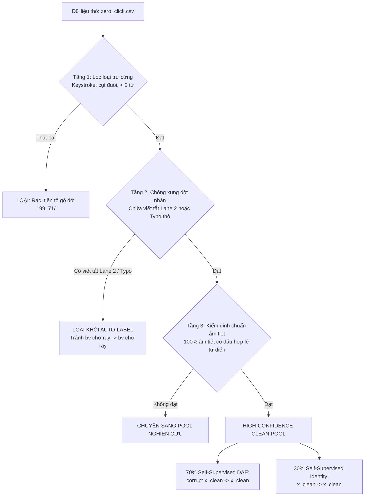

# ReparoS Base V3 — Bản Thiết Kế Dữ Liệu Toàn Diện (Data Design Specification)

**Bài toán:** Huấn luyện mô hình sửa lỗi truy vấn tiếng Việt thế hệ mới (ReparoS Base V3) từ Step 0.  
**Ngày:** 21/09/2026  
**Nguyên tắc cốt lõi:** Data-Centric AI — Dữ liệu chuẩn xác, phân tầng hạn mức (Capability Quotas), triệt tiêu xung đột nhãn (Zero Contradiction) và khóa cứng rò rỉ (Zero Leakage).

---

## 1. Triết lý Thiết kế & Hợp đồng Dữ liệu (Core Philosophy & Contracts)

### 1.1. Những bài học đắt giá từ Base V2 & Pilot Continual
1. **Base V2-32 thất bại ở từ viết tắt địa chỉ (`d.` $\rightarrow$ `đường` chỉ đạt 13.6%)**: Do dữ liệu pre-train chỉ phân bổ 0.59% cho nhóm viết tắt địa chỉ, bị áp đảo hoàn toàn bởi 75% nhiễu gõ phím thô.
2. **Base V2 chạm trần ở các thương hiệu có ký tự đặc biệt (`Biti's`, `J&T`, `4P's`)**: Do Tokenizer chỉ có 8,000 subwords và thiếu ký tự `'`, `&` dẫn đến gán nhãn `<unk>`.
3. **Cạm bẫy ngây thơ của dữ liệu chưa gán nhãn (`zero_click.csv`)**: 
   - `zero_click.csv` chứa 3.55 triệu dòng nhưng là **hard real-world distribution** (chứa đầy keystroke autocomplete dở dang `199`, `71/`, lỗi chính tả thật `bên xe`, `khách san`, và lỗi retrieval/indexing).
   - Nếu gán Identity thô ($x \rightarrow x$) sẽ gây ra **Label Contradiction trực tiếp** với Làn 2 (`bv chợ ray` $\rightarrow$ `bv chợ ray` triệt tiêu `bv chợ ray` $\rightarrow$ `bệnh viện chợ rẫy`).
   - Nếu gán DAE thô ($corrupt(x) \rightarrow x$) trên câu có lỗi, mô hình sẽ bị dạy **bảo tồn lỗi sai**.
   - Nếu bơm quá nhiều Identity, mô hình sẽ học **lối tắt sao chép (copy shortcut)**: thấy query lạ $\rightarrow$ lười sửa ($NoOpRate_{\text{edit\_required}}$ tăng vọt).

### 1.2. Các Hợp đồng Dữ liệu Bắt buộc (Mandatory Data Contracts)
* **Hợp đồng Phân chia Target Group (Target-Group Disjointness)**: Đơn vị split duy nhất là `normalized target group`. Tuyệt đối không chia theo dòng sau khi sinh nhiễu. Toàn bộ biến thể của cùng một target phải nằm trọn vẹn trong một phân vùng.
* **Hợp đồng Khóa cứng Thực thể Chưa gặp (Strict Held-out Isolation)**: Danh mục thực thể thương hiệu được phân hoạch thành hai tập rời nhau tuyệt đối: `SEEN_BRANDS` (huấn luyện) và `HELDOUT_BRANDS` (đánh giá). Tuyệt đối **0% thực thể held-out xuất hiện trong tập Train**.
* **Hợp đồng Chuẩn hóa Casing (Canonical Lowercase)**: Toàn bộ target của các thương hiệu và địa danh đều đưa về dạng chữ thường chuẩn hóa (NFKC + lowercase).
* **Hợp đồng Phân tầng Độ tin cậy (Confidence-Gating for Real Search)**: Chỉ những query từ `zero_click.csv` vượt qua bộ lọc **High-Confidence Clean** mới được đưa vào Self-Supervised DAE và Identity.

---

## 2. Kiến trúc 4 Làn Dữ liệu Huấn luyện (4-Lane Training Architecture)

```
                            TỔNG QUY MÔ PHÂN PHỐI 4 LÀN
┌──────────────────────────────────────┬──────────────────────────────────────┐
│ LÀN 1: Typing & Diacritics (40%)     │ LÀN 2: Address & Acronyms (25%)      │
│ Phục hồi lỗi gõ phím, Telex, VNI,    │ Mở rộng tiền tố địa chỉ (d. -> đường)│
│ mất dấu, sai dấu, phím kề, tách từ   │ Bung từ viết tắt địa danh (tp hcm)   │
├──────────────────────────────────────┼──────────────────────────────────────┤
│ LÀN 3: Protection & Brands (25%)     │ LÀN 4: Real Query Adaptation (10%)   │
│ - Clean Query copy-through (60%)     │ - High-Conf Denoising DAE (~70%)     │
│ - Seen Brand Entities (40%)          │ - High-Conf Identity (~30%)          │
│   (Biti's, J&T, McDonald's, Co.op...)│ (Confidence-Gated từ zero_click.csv) │
└──────────────────────────────────────┴──────────────────────────────────────┘
```

### 2.1. Chi tiết LÀN 1 — Phục hồi Lỗi gõ phím & Dấu câu (Typing & Diacritics — 40%)

* **Nguồn phôi hạt giống (Clean Seeds)**: 80,000 cụm câu địa danh sạch từ `data/osm/prepared-v4-leakfree/train`, vượt qua bộ lọc `target_rejection_reason`.
* **Hạn mức phân bổ họ lỗi (Capability Quotas)**:
  1. **`telex` (25% quota Làn 1)**:
     - Lỗi gõ lặp phím Telex: `dd` $\rightarrow$ `đ`, `ee` $\rightarrow$ `ê`, `oo` $\rightarrow$ `ô`, `aa` $\rightarrow$ `â`.
     - Lỗi gõ dấu phím: `as` $\rightarrow$ `á`, `af` $\rightarrow$ `à`, `ar` $\rightarrow$ `ả`, `ax` $\rightarrow$ `ã`, `aj` $\rightarrow$ `ạ`.
     - Lỗi sót bộ gõ (Telex leak): `dd` sót thành `d`, `w` sót thành `u/o`.
  2. **`vni` (20% quota Làn 1)**:
     - Lỗi sót phím số VNI: `d9` $\rightarrow$ `đ`, `a8` $\rightarrow$ `ă`, `a6` $\rightarrow$ `â`, `o7` $\rightarrow$ `ơ`, `u7` $\rightarrow$ `ư`.
     - Lỗi số dấu thanh: `s1` $\rightarrow$ `á`, `s2` $\rightarrow$ `à`, `s3` $\rightarrow$ `ả`, `s4` $\rightarrow$ `ã`, `s5` $\rightarrow$ `ạ`.
  3. **`missing_diacritics` (20% quota Làn 1)**:
     - `missing_full` (10%): Bỏ dấu toàn bộ câu (`duong nguyen trai` $\rightarrow$ `đường nguyễn trãi`).
     - `missing_partial` (10%): Bỏ dấu một hoặc hai từ ngẫu nhiên trong câu.
  4. **`wrong_diacritic_or_shape` (15% quota Làn 1)**:
     - Đặt sai vị trí dấu thanh (`hòa` vs `hoà`, `thủy` vs `thuỷ`).
     - Lẫn lộn mũ và móc (`hướng` vs `hưống`, `đường` vs `đưòng`).
  5. **`word_boundary` (10% quota Làn 1)**:
     - Dính từ: `đườngnguyễn trãi`, `quận1`, `phườngbến nghé`.
     - Tách từ sai: `đ ư ờng`, `nguy ễn`, `t p hcm`.
  6. **`keyboard_neighbor` (10% quota Làn 1)**:
     - Gõ nhầm phím liền kề trên bàn phím QWERTY tiếng Việt (`duong` $\rightarrow$ `suong`, `quan` $\rightarrow$ `wuan`).

---

### 2.2. Chi tiết LÀN 2 — Địa chỉ Rút gọn & Từ viết tắt Ngữ cảnh (Address & Acronyms — 25%)

* **Cấu phần 2A: Chuẩn hóa Tiền tố Địa chỉ (Address Prefix Expansion — 60% Làn 2)**:
  - **Bảng quy chuẩn ánh xạ (Mapping Registry)**:
    - `d.` / `đ.` / `d ` / `đ ` $\rightarrow$ `đường `
    - `q.` / `q ` $\rightarrow$ `quận `
    - `p.` / `p ` $\rightarrow$ `phường `
    - `tp.` / `tp ` $\rightarrow$ `thành phố `
    - `tx.` $\rightarrow$ `thị xã `
    - `tt.` $\rightarrow$ `thị trấn `
    - `ql.` $\rightarrow$ `quốc lộ `
    - `tl.` $\rightarrow$ `tỉnh lộ `
    - `kdc.` $\rightarrow$ `khu dân cư `
    - `kcn.` $\rightarrow$ `khu công nghiệp `
  - **Ràng buộc bảo vệ bắt buộc (Negative Lookbehind Protection)**:
    - Áp dụng biểu thức chính quy chặt chẽ: `(?<!\bthành\s)(?:đường|phố)` để tuyệt đối **không biến `thành phố` thành `thành đường`**.
    - Bảo vệ số nhà, mã đường: `đường số 3`, `đường 2/9`, `đường 3/2`, `quốc lộ 1a` không bị bung nhầm.

* **Cấu phần 2B: Từ viết tắt Ngữ cảnh (Contextual Acronyms — 25% Làn 2)**:
  - Chỉ bung khi nằm trong khung ngữ cảnh hoàn chỉnh:
    - `tp hcm`, `tphcm`, `hcm` $\rightarrow$ `thành phố hồ chí minh`
    - `hn` $\rightarrow$ `hà nội`, `đn` $\rightarrow$ `đà nẵng`, `hp` $\rightarrow$ `hải phòng`, `ct` $\rightarrow$ `cần thơ`
    - Tên viết tắt có ngữ cảnh giao thông/địa điểm: `đoạn ltk giao với...` $\rightarrow$ `đoạn lý thường kiệt giao với...`, `ở nct q1` $\rightarrow$ `ở nguyễn chí thanh quận 1`.
    - Bệnh viện/cơ quan: `bv chợ rẫy` $\rightarrow$ `bệnh viện chợ rẫy`, `bv bạch mai` $\rightarrow$ `bệnh viện bạch mai`, `ubnd p.1` $\rightarrow$ `ủy ban nhân dân phường 1`.
  - **Chính sách từ chối (No-Op Policy)**: Nếu viết tắt đứng đơn lẻ, không có ngữ cảnh hỗ trợ (`ltk`, `nct`, `nv`), mô hình **bắt buộc giữ nguyên (No-Op)**.

* **Cấu phần 2C: Lỗi Tổ hợp Đa tầng (Compositional Multi-Error — 15% Làn 2)**:
  - Kết hợp đồng thời lỗi gõ phím + viết tắt địa chỉ trong cùng một truy vấn:
    - `d. tran hung dao q1` $\rightarrow$ `đường trần hưng đạo quận 1`
    - `hem 42/21 d so 5 p bn` $\rightarrow$ `hẻm 42/21 đường số 5 phường bến nghé`

---

### 2.3. Chi tiết LÀN 3 — Bảo vệ Tuyệt đối Câu sạch & Thương hiệu (Hard No-Change & Brands — 25%)

* **Cấu phần 3A: Bảo vệ Câu sạch Tự nhiên (Clean Query Identity — 60% Làn 3)**:
  - Dạng cặp $(x \rightarrow x)$ trích xuất trực tiếp từ các câu sạch chuẩn mực trong OSM.
  - Mục tiêu: Huấn luyện thiên hướng bảo toàn (Identity Prior) — nếu truy vấn đã đúng chính tả thì sao chép nguyên trạng sang đích.

* **Cấu phần 3B: Thực thể Thương hiệu & Tên riêng (Brand Entities & Proper Nouns — 40% Làn 3)**:
  - **Nguyên tắc phân hoạch rời nhau tuyệt đối (Strict Disjointness)**:
    - **Tập SEEN (`SEEN_BRANDS` — 50 thương hiệu/thực thể)**:
      `techcombank`, `starbucks`, `vincom`, `shopee`, `vinfast`, `the manor`, `mcdonald's`, `highlands coffee`, `grab`, `vpbank`, `mb bank`, `thế giới di động`, `điện máy xanh`, `viettel post`, `co.opmart`, `bv bank`, `vietcombank`, `bidv`, `agribank`, `tpbank`, `phúc long`, `lotteria`, `kfc`, `jollibee`, `circle k`, `ministop`, `gs25`, `winmart`, `emart`, `lotte mart`, `aeon mall`, `crescent mall`, `sc vivocity`, `takashimaya`, `landmark 81`, `bitexco`, `golden gate`, `redsun`, `hải xồm`, `thu cúc`, `tâm anh`...
    - **Tập HELDOUT (`HELDOUT_BRANDS` — 50 thương hiệu DÀNH RIÊNG CHO EVAL — BỊ CẤM TRONG TRAIN)**:
      `biti's`, `pizza 4p's`, `katinat`, `annam gourmet`, `gigamall`, `tiki`, `lazada`, `j&t express`, `pharmacity`, `long châu`, `bách hóa xanh`, `acb bank`, `vib bank`, `msb`, `shopeefood`, `dookki`, `haidilao`, `manwah`, `gogi house`, `kichi kichi`, `chut chut`, `the coffee house`, `cheese coffee`, `phê la`, `cong caphe`, `baemin`, `be group`, `ahamove`, `ninja van`, `shopee express`, `vietnam airlines`, `vietjet air`, `bamboo airways`, `medlatec`, `hoàn mỹ`, `hồng ngọc`, `vinmec`, `chợ bến thành`, `cầu rồng`, `bà nà hills`, `hồ tây`, `suối tiên`, `đầm sen`...
  - **Khung câu ngữ cảnh tự nhiên (Sentence Context Frames)**:
    - `chi nhánh {entity} quận 1`
    - `uống cà phê ở {entity}`
    - `siêu thị {entity} gần nhất`
    - `địa chỉ quán ăn {entity}`
    - `cửa hàng {entity} đường 3/2`
  - **Target Policy**: Toàn bộ tên thương hiệu ở target đều ở dạng chữ thường chuẩn hóa (`biti's`, `pizza 4p's`, `j&t express`), triệt tiêu việc phạt oan do casing.

---

### 2.4. Chi tiết LÀN 4 — Thích ứng Truy vấn Tìm kiếm Thực tế (Real Query Adaptation — 10%)

* **Nguồn dữ liệu**: File log truy vấn thực tế `data/zero_click.csv` (3.55 triệu dòng).
* **Bộ lọc Phân tầng Độ tin cậy (Confidence-Gated Quality Filter)**:



#### Quy tắc phân loại chi tiết:
1. **Tầng 1 — Lọc loại trừ cứng (Hard Rejection)**:
   - Loại bỏ query rỗng, chứa ký tự rác/mojibake.
   - Loại bỏ các chuỗi tìm kiếm dở dang (keystroke increments / prefixes):
     - Kết thúc bằng ký tự đặc biệt cụt: `/`, `-`, `,`, `.` (ví dụ: `71/`, `đường số 5-`).
     - Chuỗi số cụt hoặc từ dở dang: `199`, `199 hồ`, `199 hồ t`, `36 ngõ`, `nhà gas t`.
   - Loại bỏ query quá ngắn: Số từ $< 2$ (trừ các thực thể đơn hợp lệ đã đăng ký).
2. **Tầng 2 — Lọc chống xung đột nhãn (Contradiction & Error Rejection)**:
   - **Chặn xung đột với Lane 2**: Nếu query chứa các token viết tắt cần bung của Lane 2 (`bv`, `d.`, `đ.`, `q.`, `p.`, `tp hcm`, `hn`...) $\rightarrow$ **Tuyệt đối không đưa vào nhánh Identity** để tránh xung đột `bv chợ ray` $\rightarrow$ `bv chợ ray`.
   - **Chặn bảo tồn lỗi**: Nếu query chứa các lỗi chính tả thô đã biết (`bên xe`, `khách san`) $\rightarrow$ **Tuyệt đối không đưa vào Identity hoặc DAE**.
3. **Tầng 3 — Nhận diện High-Confidence Clean Query**:
   - Độ dài từ 2 đến 8 từ.
   - 100% các từ đều là âm tiết tiếng Việt có dấu đầy đủ, hợp lệ theo từ điển âm tiết chuẩn (hoặc là từ mượn/số nhà hợp lệ).
   - Không có cấu trúc cụt ngữ pháp.

#### Phân bổ nội bộ trong Làn 4:
* **Nhánh 4A: Self-Supervised Denoising (DAE — ~70% Làn 4)**:
  - Chọn câu từ pool High-Confidence làm Target $Y = x_{\text{clean}}$.
  - Bơm nhiễu tổng hợp có kiểm soát (bỏ dấu, lỗi gõ phím, dính từ) để tạo Input $X = corrupt(Y)$.
  - Cặp dữ liệu: $(corrupt(Y) \rightarrow Y)$.
  - Mục đích: Dạy cho mô hình học cấu trúc câu, từ vựng và ngữ cảnh tìm kiếm thực tế của người dùng.
* **Nhánh 4B: Self-Supervised Identity Protection (~30% Làn 4)**:
  - Lấy nguyên vẹn câu High-Confidence: $(x_{\text{clean}} \rightarrow x_{\text{clean}})$.
  - Mục đích: Giúp mô hình quen với văn phong tìm kiếm thực tế mà không sửa bậy.
  - Khống chế ở mức 30% Làn 4 (~3% tổng dữ liệu huấn luyện) để ngăn chặn nguy cơ học lối tắt sao chép (Copy shortcut / $NoOpRate_{\text{edit\_required}}$).

---

## 3. Ma Trận Dữ Liệu Cho Thực Nghiệm Ablation (300,000 Pairs/Run)

Để kiểm chứng khoa học đóng góp của Làn 4 và phân bổ tỷ lệ tối ưu, chúng ta thiết lập 3 tập dữ liệu huấn luyện rút gọn (~300k pairs/tập, đủ cho 20,000 steps trên GPU):

| Hạng mục dữ liệu | Run A (No Lane 4) | Run B (Lane 4 DAE-Only) | Run C (Lane 4 DAE + Identity) |
| :--- | :---: | :---: | :---: |
| **Làn 1 (Typing & Diacritics)** | **45%** (135,000 pairs) | **40%** (120,000 pairs) | **40%** (120,000 pairs) |
| **Làn 2 (Address & Acronyms)** | **30%** (90,000 pairs) | **25%** (75,000 pairs) | **25%** (75,000 pairs) |
| **Làn 3 (Protection & Seen Brands)** | **25%** (75,000 pairs) | **25%** (75,000 pairs) | **25%** (75,000 pairs) |
| - *Clean Query Identity* | *45,000 pairs* | *45,000 pairs* | *45,000 pairs* |
| - *Seen Brand Protection* | *30,000 pairs* | *30,000 pairs* | *30,000 pairs* |
| **Làn 4 (Real Query Adaptation)** | **0%** (0 pairs) | **10% (100% DAE)** (30,000 pairs) | **10% (70% DAE + 30% Id)** (30,000 pairs) |
| - *High-Conf DAE* | *0* | *30,000 pairs* | *21,000 pairs* |
| - *High-Conf Identity* | *0* | *0* | *9,000 pairs* |
| **Tổng số cặp câu** | **300,000 pairs** | **300,000 pairs** | **300,000 pairs** |

---

## 4. Bộ Dữ Liệu Kiểm Định Đóng Băng Chuẩn (Unified Frozen Eval Suite — 3,100 Rows)

Bộ dữ liệu đánh giá được đóng băng tuyệt đối, dùng chung cho cả 3 runs Ablation và Full Run 50k steps:

| Tên tập kiểm định | Quy mô | Phân bổ nội dung kiểm tra | Mục tiêu kiểm định tối thiểu |
| :--- | :---: | :--- | :---: |
| **`eval/plasticity`** | 700 dòng | - 250 câu viết tắt tiền tố địa chỉ (`d.`, `q.`, `p.`)<br/>- 250 câu từ viết tắt ngữ cảnh (`tp hcm`, `hn`, `đn`)<br/>- 200 câu tổ hợp (viết tắt + lỗi gõ) | $\text{Accuracy} \ge 92.0\%$ |
| **`eval/retention`** | 1,200 dòng | - 200 Telex, 200 VNI, 200 mất dấu<br/>- 200 sai dấu, 200 phím kề, 200 tách/dính từ<br/>(Lấy từ OSM leak-free test split) | $\text{Accuracy} \ge 88.0\%$ |
| **`eval/protection_seen`** | 400 dòng | - 200 câu sạch OSM train<br/>- 200 câu chứa 50 thương hiệu `SEEN_BRANDS` | $FCR_{\text{seen}} \le 0.5\%$ |
| **`eval/protection_heldout`** | 500 dòng | - 300 câu chứa 50 thương hiệu `HELDOUT_BRANDS`<br/>- 100 câu tên riêng lạ<br/>- 100 câu sạch OSM test | **$FCR_{\text{heldout}} \le 1.0\%$**<br/>(ZERO LEAK) |
| **`eval/user_centric`** | 300 dòng | 300 câu truy vấn người dùng thực tế có nhãn sửa chuẩn được gán thủ công / thẩm định nghiêm ngặt | $\text{Accuracy} \ge 85.0\%$ |

---

## 5. Quy Trình Kiểm Toán Chất Lượng Dữ Liệu (Data Audit Protocols)

Trước khi bắt đầu huấn luyện, toàn bộ dữ liệu phải vượt qua bộ script kiểm toán tự động `scripts/audit_base_v3_dataset.py`:

1. **Kiểm toán Rò rỉ (Zero-Leakage Test)**:
   $$\text{Queries}(\text{Train}) \cap \text{Queries}(\text{Eval}) = \emptyset$$
   $$\forall b \in \text{HELDOUT\_BRANDS}: b \notin \text{Text}(\text{Train})$$
2. **Kiểm toán Xung đột Nhãn (Label-Contradiction Test)**:
   $$\nexists (x, y_1) \in \text{Lane 4}, (x, y_2) \in \text{Lanes 1, 2, 3} \quad \text{sao cho} \quad y_1 \neq y_2$$
3. **Kiểm toán Không Token Lạ (Zero-UNK Test)**:
   $$\forall (x, y) \in \text{Train} \cup \text{Eval}: \text{UNK\_ID} \notin \text{Encode}(x) \land \text{UNK\_ID} \notin \text{Encode}(y)$$

---

## 6. Lộ Trình Triển Khai Dữ Liệu Thực Tế (Execution Plan)

* **Bước 1 — Xây dựng Bộ lọc & Registry (`src/reparos/data_registry.py` & `src/reparos/quality_filter.py`)**:
  - Đóng gói danh sách `SEEN_BRANDS` và `HELDOUT_BRANDS`.
  - Cài đặt thuật toán lọc 3 tầng cho `data/zero_click.csv`.
* **Bước 2 — Xây dựng Bộ sinh Dữ liệu Ablation (`scripts/build_base_v3_ablation_datasets.py`)**:
  - Trích xuất hạt giống OSM và tạo 3 bộ dataset (`dataset_run_a/`, `dataset_run_b/`, `dataset_run_c/`).
  - Tạo bộ test đóng băng chuẩn `data/base_v3_eval/`.
* **Bước 3 — Chạy Script Kiểm toán Toàn vẹn (`scripts/audit_base_v3_dataset.py`)**:
  - Xác nhận 0 leak, 0 contradiction, 0 UNK.
* **Bước 4 — Xuất bản Dữ liệu sẵn sàng cho Huấn luyện**.
