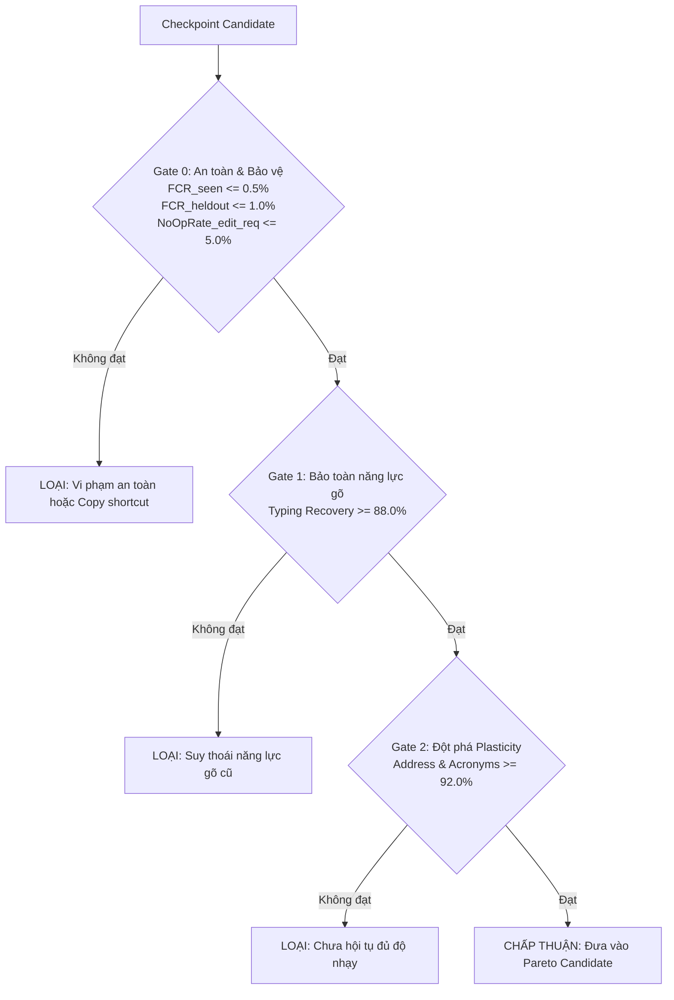

# ReparoS Base V3 — Next-Generation Pre-Training Specification

## 1. Bối cảnh & Động lực (Context & Motivation)

### 1.1. Phát hiện thực nghiệm từ Base V2 & Pilot Continual
Trong quá trình kiểm chứng thực nghiệm mô hình sửa lỗi truy vấn tiếng Việt **ReparoS**, chúng ta đã xác lập các kết quả then chốt:
1. **Base V2-32 (Baseline)**: Huấn luyện trên 7.06 triệu cặp câu OSM (75% nhiễu gõ phím / 25% câu sạch). Mô hình có khả năng phục hồi lỗi gõ phím rất cao (~83.7%), nhưng bị tê liệt ở nhóm từ viết tắt địa chỉ (`d.` $\rightarrow$ `đường` chỉ đạt 13.6%) do nhóm này chỉ chiếm 0.59% dữ liệu pre-train.
2. **Pilot Continual Fine-Tuning (3,000 steps)**:
   - **Đột phá Plasticity**: Năng lực học cái mới tăng từ **19.57% lên 84.43% (+64.86%)**, trong đó viết tắt địa chỉ đạt **86.8%** và từ viết tắt ngữ cảnh (`tp hcm`, `hn`) đạt **99.2%**. Năng lực cũ (**Retention**) được bảo toàn nguyên vẹn ở mức **83.9%**.
   - **Phát hiện điểm nghẽn kiến trúc (Architectural Bottleneck)**: Tỷ lệ sửa sai trên thương hiệu chưa gặp (**Held-out Brand FCR**) bị kẹt ở mức 14.0%.
   - **Xác thực thực nghiệm (Zero-Guesswork Evidence)**: Bài kiểm tra `check_tokenizer_roundtrip.py` xác nhận 100% ký tự `'` (nháy đơn) và `&` (ampersand) trong `Biti's`, `Pizza 4P's`, `McDonald's`, `J&T` bị Tokenizer Base V2 gán mã `<unk>` (Token ID = 3). Khi bật `disable_unk: true`, Decoder buộc phải sinh ra các từ dị dạng (`bitituis`, `pizza 4p ⁇ s`).
3. **Kết luận chiến lược**: Base V2 đã chạm trần kiến trúc do từ vựng. Cần xây dựng **ReparoS Base V3** được huấn luyện từ đầu (Step 0) với Tokenizer mới và kiến trúc dữ liệu khoa học.

### 1.2. Mục tiêu cốt lõi của Base V3
1. **Triệt tiêu hoàn toàn điểm mù Tokenizer**: Mở rộng từ vựng hỗ trợ 100% các ký tự đặc biệt của thương hiệu (`'`, `&`, `.`, `/`, `-`, số), bảo đảm **0% `<unk>` round-trip**.
2. **Hợp nhất phân phối 4 làn dữ liệu (4-Lane High-Density Distribution)**: Cân bằng toán học giữa Phục hồi lỗi gõ (Lane 1), Viết tắt địa chỉ & ngữ cảnh (Lane 2), Bảo vệ thương hiệu & câu sạch (Lane 3), và Thích ứng truy vấn đời thực (Lane 4).
3. **Phân tích chất lượng có kiểm soát cho Lane 4 (Confidence-Gated Real Query Adaptation)**: Không giả định ngây thơ rằng log tìm kiếm thô là nhãn sạch; phân tầng độ tin cậy để loại bỏ triệt để xung đột nhãn (Label Contradiction) và lối tắt sao chép (Copy Shortcut).
4. **Quy trình khoa học thực nghiệm (Empirical Ablation First)**: Không vội vã chạy 50k steps với cấu hình võ đoán. Tiến hành thử nghiệm ablation ngắn (5k–10k steps) để chứng minh đóng góp của từng thành phần dữ liệu trước khi huấn luyện toàn phần.

---

## 2. Tokenizer V3 Architecture & Normalization

```mermaid
flowchart LR
    Raw[Văn bản thô: Biti's, J&T, d. 768, tp hcm] --> Norm[Bộ chuẩn hóa NFKC + Lowercase đồng bộ]
    Norm --> SymInject[Bổ sung User-Defined Symbols: ', &, ., /, -]
    SymInject --> SP_Train[SentencePiece Unigram / BPE Training]
    SP_Train --> V3_Vocab[Tokenizer V3 Model: Vocab 12,000 | 0% UNK]
```

### 2.1. Thông số kỹ thuật Tokenizer V3
* **Thuật toán phân đoạn**: SentencePiece (BPE hoặc Unigram).
* **Quy mô từ vựng (Vocabulary Size)**: **12,000 subwords** (tăng từ 8,000 của Base V2). 
  - Với chiều ẩn `hidden_size: 128`, việc tăng từ 8k lên 12k chỉ làm tăng ma trận Embedding thêm:
    $$\Delta \text{Params} = (12,000 - 8,000) \times 128 \times 2 = 1,024,000 \text{ tham số} \approx 2.0\text{ MB RAM}$$
    Hoàn toàn không ảnh hưởng đến độ trễ suy luận của CTranslate2 trên CPU.
* **Độ bao phủ ký tự (Character Coverage)**: **`1.0` (100%)** — Tuyệt đối không cho phép bất kỳ ký tự nào trong tập dữ liệu bị loại trừ ra ngoài từ vựng.
* **Các ký tự bắt buộc (User-Defined / Pre-tokenization Symbols)**:
  - Dấu nháy đơn: `'` (cho `Biti's`, `Pizza 4P's`, `McDonald's`, `L'Oréal`).
  - Dấu ampersand: `&` (cho `J&T Express`, `D&G`, `H&M`, `P&G`).
  - Ký tự địa chỉ & số: `/`, `-`, `.`, `,`, `0` đến `9`.
  - Các hình thái subword thương hiệu thông dụng: `mart`, `express`, `bank`, `food`, `mall`, `hub`, `katinat`, `dookki`, `shopee`, `tiki`, `lazada`, `grab`, `gojek`, `starbucks`, `highlands`, `phuclong`.

### 2.2. Chiến lược chuẩn hóa chữ hoa / chữ thường (Casing Strategy)
* **Quy chuẩn đồng bộ (Canonical Lowercasing)**:
  Trong hệ thống xử lý tìm kiếm tiếng Việt, toàn bộ câu truy vấn người dùng nhập vào (`Techcombank`, `TECHCOMBANK`, `techcombank`) đều mang cùng một ý định tìm kiếm.
* Tokenizer V3 được huấn luyện trên dữ liệu đã chuẩn hóa chữ thường (lowercase) đồng bộ.
* Mọi thực thể thương hiệu trong target đều có dạng chữ thường chuẩn hóa (`techcombank`, `biti's`, `j&t express`), loại bỏ triệt để hiện tượng phạt oan False Correction do khác biệt chữ hoa/chữ thường.

### 2.3. Tiêu chuẩn nghiệm thu Tokenizer V3 (Mandatory Acceptance Gate)
Script kiểm tra round-trip độc lập phải xác nhận:
$$\forall s \in \{\text{"'"}, \text{"&"}, \text{"."}, \text{"4P's"}, \text{"McDonald's"}, \text{"J&T"}, \text{"Biti's"}, \text{"Co.opmart"}\}: \text{Decode}(\text{Encode}(s)) \equiv s \quad \land \quad \text{UNK\_ID} \notin \text{Encode}(s)$$

---

## 3. Kiến trúc dữ liệu huấn luyện 4 làn (4-Lane Training Architecture)

```
                            TỔNG QUY MÔ DỮ LIỆU CƠ SỞ: 4,000,000 PAIRS
┌──────────────────────────────────────┬──────────────────────────────────────┐
│ Lane 1: Typing & Diacritics (~40%)   │ Lane 2: Address & Acronyms (~25%)    │
│ 1,600,000 pairs                      │ 1,000,000 pairs                      │
│ - Telex, VNI, Dấu, Phím kề, Tách từ  │ - d. -> đường, q. -> quận, tp hcm    │
├──────────────────────────────────────┼──────────────────────────────────────┤
│ Lane 3: Protection & Brands (~25%)   │ Lane 4: Real Query Adaptation (~10%) │
│ 1,000,000 pairs                      │ 400,000 pairs (Confidence-Gated)     │
│ - Clean Query copy-through           │ - High-Conf Self-Supervised DAE (~70%)│
│ - Brand Entities (Biti's, J&T...)    │ - High-Conf Identity Protection (~30%)│
└──────────────────────────────────────┴──────────────────────────────────────┘
```

### 3.1. Phân tích chuyên sâu Làn 4: Real Query Adaptation (Khắc phục ngộ nhận Zero-Click)

#### A. Bản chất phân phối Zero-Click (`zero_click.csv`)
Khảo sát thực nghiệm trên `data/zero_click.csv` (204.5 MB, ~3.55 triệu dòng) cho thấy:
1. **Zero-click không phải là mẫu ngẫu nhiên đại diện cho toàn bộ production search distribution**:
   - Zero-click là tập hợp các truy vấn mà công cụ tìm kiếm **không trả về kết quả hoặc người dùng không click vào kết quả nào**.
   - Phân phối này tập trung mật độ cao các ca khó: lỗi chính tả nặng, thực thể ngoài tầm phủ (out-of-coverage), truy vấn mơ hồ, tiền tố gõ dở dang (search-as-you-type keystrokes như `199`, `71/`, `nhà gas t`, `36 ngõ`), và lỗi do retrieval/indexing chứ không phải do câu sai.
2. **Nguy cơ Xung đột nhãn (Label Contradiction Hazard)**:
   - Nếu coi raw query là target sạch:
     - Giả sử query thô là `bv chợ ray` hoặc `benh vien cho ray`.
     - Nếu gán Identity: $\text{"bv chợ ray"} \rightarrow \text{"bv chợ ray"}$, trong khi Lane 2 đang dạy $\text{"bv chợ ray"} \rightarrow \text{"bệnh viện chợ rẫy"}$, ta tạo ra **label contradiction trực tiếp** làm tê liệt mô hình.
     - Nếu gán DAE: $corrupt(\text{"benh vien cho ray"}) \rightarrow \text{"benh vien cho ray"}$, ta đang dạy ReparoS bảo tồn chính lỗi chính tả mà nó có nhiệm vụ phải sửa!
3. **Nguy cơ Lối tắt sao chép (Copy Shortcut / False Invariance)**:
   - Bài toán cốt lõi của ReparoS là phân biệt đúng giữa:
     $$\text{EDIT} \quad \text{vs} \quad \text{NO-EDIT}$$
   - Nếu bơm một lượng lớn raw queries vào mục tiêu Identity ($x \rightarrow x$), mô hình sẽ học được shortcut nguy hiểm: *Cứ thấy query lạ hoặc khó hiểu $\rightarrow$ Copy nguyên xi*.
   - Đây chính là failure mode mà chỉ số $NoOpRate_{\text{edit\_required}}$ được thiết kế để phát hiện.

#### B. Thiết kế Phân tầng Độ tin cậy (Confidence-Gated Filter) cho Lane 4

```
                           ZERO-CLICK QUERY (RAW)
                                     │
                        Quality & Confidence Analysis
                                     │
        ┌────────────────────────────┼────────────────────────────┐
        ▼                            ▼                            ▼
 HIGH-CONFIDENCE CLEAN           AMBIGUOUS                   NOISY / TYPO
        │                            │                            │
        ▼                            ▼                            ▼
 - Complete Vietnamese sentence  - Keystroke increments (`199`,   - Obvious spelling error
 - Full, valid diacritics          `71/`, `nhà gas t`)              (`bên xe`, `khách san`)
 - Dictionary / Entity valid     - Ambiguous acronyms             - Contradicts Lane 1/2
        │                            │                            │
        ▼                            ▼                            ▼
 Candidates for:                LOẠI BỎ KHỎI AUTO-LABEL          CHỈ DÙNG KHI CÓ
 ├── DAE (~70%): corrupt(x) -> x   (Chuyển sang pool nghiên cứu)    TARGET ĐÁNG TIN CẬY
 └── Identity (~30%): x -> x
```

* **Bộ quy tắc phân loại tự động (Classification Rules)**:
  1. **High-Confidence Clean**:
     - Độ dài từ $\ge 2$ từ, có đầy đủ dấu thanh tiếng Việt hợp lệ theo từ điển âm tiết chuẩn.
     - Không chứa ký tự dở dang ở đuôi (không kết thúc bằng `/`, `-`, số cụt, hoặc từ đơn lẻ vô nghĩa).
     - Không chứa token thuộc danh mục viết tắt cần bung của Lane 2 (`bv`, `d.`, `q.`, `tp hcm`...).
     - Được phép đưa vào:
       - **Self-Supervised DAE (~70% trong Lane 4)**: $x' = corrupt(x) \rightarrow y = x$ (tạo nhiễu gõ/bỏ dấu trên câu sạch thực tế).
       - **Self-Supervised Identity (~30% trong Lane 4)**: $x \rightarrow x$ (bảo tồn câu tìm kiếm thực tế đã chuẩn mực).
  2. **Ambiguous**:
     - Các đoạn truy vấn gõ dở (`199 hồ`, `nhà gas t3`, `36 ngõ 23 nhật`).
     - Các từ viết tắt không có ngữ cảnh rõ ràng.
     - **Hành động**: Loại bỏ hoàn toàn khỏi tập huấn luyện tự động để tránh nhiễu ranh giới quyết định.
  3. **Noisy / Known Error**:
     - Chứa từ sai chính tả rõ rệt (`bên xe` $\rightarrow$ `bến xe`, `khách san` $\rightarrow$ `khách sạn`).
     - **Hành động**: Tuyệt đối không tự động gán $x \rightarrow x$. Chỉ sử dụng khi có nhãn sửa chuẩn từ từ điển hoặc dữ liệu giám sát.

---

### 3.2. Chi tiết 3 Làn dữ liệu Giám sát (Supervised Lanes 1–3)

#### Làn 1: Phục hồi lỗi gõ phím & Dấu câu (Typing & Diacritics Recovery — 40% = 1.6M pairs)
* **Nguồn phôi sạch (Clean Seeds)**: 80,000 câu OSM chất lượng cao vượt qua bộ lọc chất lượng `target_rejection_reason`.
* **Phân bổ loại lỗi nội bộ**:
  - `telex` (25%): Lỗi gõ trùng phím Telex (`dd` $\rightarrow$ `đ`, `ee` $\rightarrow$ `ê`, `as` $\rightarrow$ `á`).
  - `vni` (20%): Lỗi sót phím số VNI (`d9` $\rightarrow$ `đ`, `a8` $\rightarrow$ `ă`, `o7` $\rightarrow$ `ơ`).
  - `missing_diacritics` (20%): Mất dấu hoàn toàn hoặc một phần.
  - `wrong_diacritic` (15%): Đặt dấu sai vị trí hoặc sai thanh điệu.
  - `boundary` (10%): Dính từ (`đườngnguyễn`) hoặc tách từ sai (`n guyễn`).
  - `keyboard` (10%): Lỗi gõ phím kề trên bàn phím QWERTY (`duong` $\rightarrow$ `suong`).

#### Làn 2: Viết tắt địa chỉ & Từ viết tắt ngữ cảnh (Address & Acronyms — 25% = 1.0M pairs)
* **Địa chỉ rút gọn (Address Abbreviations — 600k pairs)**:
  - Mẫu mở rộng: `d.` / `đ.` / `d ` / `đ ` $\rightarrow$ `đường`, `q.` / `q ` $\rightarrow$ `quận`, `p.` / `p ` $\rightarrow$ `phường`, `tp.` $\rightarrow$ `thành phố`, `tx.` $\rightarrow$ `thị xã`, `tt.` $\rightarrow$ `thị trấn`, `ql.` $\rightarrow$ `quốc lộ`, `tl.` $\rightarrow$ `tỉnh lộ`, `kdc.` $\rightarrow$ `khu dân cư`, `kcn.` $\rightarrow$ `khu công nghiệp`.
  - **Ràng buộc bảo vệ bắt buộc (Negative Lookbehind Protection)**:
    Áp dụng regex `(?<!\bthành\s)(?:đường|phố)` để tuyệt đối không tạo ra lỗi biến `thành phố` $\rightarrow$ `thành đường`.
* **Từ viết tắt ngữ cảnh (Contextual Acronyms — 250k pairs)**:
  - `tp hcm` / `tphcm` / `hcm` $\rightarrow$ `thành phố hồ chí minh`
  - `hn` $\rightarrow$ `hà nội`, `đn` $\rightarrow$ `đà nẵng`, `hp` $\rightarrow$ `hải phòng`, `ct` $\rightarrow$ `cần thơ`.
  - Số thứ tự quận: `q1` $\rightarrow$ `quận 1`, `q.10` $\rightarrow$ `quận 10`.
* **Tổ hợp lỗi (Compositional — 150k pairs)**: Kết hợp lỗi gõ phím + viết tắt địa chỉ trong cùng một câu (ví dụ: `d. tran hung dao q1` $\rightarrow$ `đường trần hưng đạo quận 1`).

#### Làn 3: Bảo vệ tuyệt đối câu sạch & Thương hiệu (Hard No-Change & Brands — 25% = 1.0M pairs)
* **Câu sạch tự nhiên (Clean Query Identity — 600k pairs)**:
  - Dạng cặp: $(x \rightarrow x)$ lấy từ hạt giống sạch OSM.
  - Dạy cho mô hình xu hướng bất biến (identity prior): nếu câu đã đúng chính tả thì sao chép nguyên vẹn sang đích.
* **Thương hiệu & Tên riêng (Brand Entities & Proper Nouns — 400k pairs)**:
  - 100+ thương hiệu phổ biến trong nước và quốc tế đặt trong các ngữ cảnh tìm kiếm (`chi nhánh {entity} quận 1`, `uống cà phê tại {entity}`, `mua đồ ở siêu thị {entity}`).
  - Bao phủ đầy đủ các thương hiệu chứa ký tự đặc biệt: `Biti's`, `Pizza 4P's`, `McDonald's`, `J&T Express`, `Co.opmart`, `ShopeeFood`, `Starbucks`, `Techcombank`, `TPBank`, `MB Bank`, `Dookki`, `Katinat`, `GigaMall`...
  - **Nguyên tắc phân hoạch nghiêm ngặt (Strict Entity Disjointness)**:
    - 50 thực thể đưa vào tập huấn luyện (Seen).
    - 50 thực thể khác bị **khóa cứng tuyệt đối (Held-out)**, không bao giờ xuất hiện trong tập Train, chỉ dùng để đánh giá năng lực bảo vệ ở Gate 0.

---

## 4. Model Architecture & Hyperparameter Configuration

### 4.1. Kiến trúc mô hình (Model Architecture)
Tiếp tục duy trì thiết kế siêu nhẹ (Ultra-lightweight Transformer) đã chứng minh hiệu năng phục vụ thực tế vượt trội của ReparoS:

| Tham số kiến trúc | Giá trị Base V3 | Giải thích kỹ thuật |
| :--- | :---: | :--- |
| **Encoder Layers** | **2** | Trích xuất đặc trưng ngữ cảnh 2 chiều |
| **Decoder Layers** | **1** | Giải mã tự hồi quy cực nhanh |
| **Hidden Size ($d_{\text{model}}$)** | **128** | Nhỏ gọn, biểu diễn vừa đủ cho tập từ vựng tiếng Việt |
| **FFN Inner Size ($d_{\text{ff}}$)** | **2048** | Mở rộng dung lượng biểu diễn phi tuyến của MLP |
| **Attention Heads** | **8** | 16 chiều mỗi head ($128 / 8$) |
| **Vocabulary Size** | **12,000** | Tokenizer V3 không có ký tự `<unk>` |
| **Total Parameters** | **~6.5M – 6.6M** | Kích thước file `.pt` $\approx 77\text{ MB}$, file CT2 $\approx 35\text{ MB}$ (Vocab 12k tăng embedding) |
| **CPU Latency** | **$< 5.0\text{ ms}$** | CTranslate2 Float16/Int8 trên 1 nhân CPU |

### 4.2. Tham số huấn luyện (OpenNMT-py Training Regimen)
Khắc phục triệt để lỗi tràn iterator (`AssertionError: No inf checks`) của Base V2:

```json
{
  "encoder_type": "transformer",
  "decoder_type": "transformer",
  "enc_layers": 2,
  "dec_layers": 1,
  "hidden_size": 128,
  "transformer_ff": 2048,
  "heads": 8,
  "model_dtype": "fp16",
  "batch_type": "tokens",
  "batch_size": 8192,
  "bucket_size": 32768,
  "accum_count": [1],
  "normalization": "tokens",
  "num_workers": 2,
  "optim": "adam",
  "adam_beta1": 0.9,
  "adam_beta2": 0.998,
  "adam_eps": 1e-08,
  "max_grad_norm": 1.0,
  "learning_rate": 1.0,
  "decay_method": "noam",
  "warmup_steps": 2000,
  "valid_steps": 1000,
  "save_checkpoint_steps": 2500,
  "keep_checkpoint": 10,
  "seed": 2026
}
```

---

## 5. Evaluation Protocol & 3-Tier Hierarchical Gates

Mỗi checkpoint lưu lại sẽ được tự động xuất sang CTranslate2 và đánh giá qua hệ thống kiểm duyệt 3 tầng phân cấp:



### 5.1. Tiêu chí chi tiết từng Gate

| Cổng kiểm định | Tập kiểm tra | Chỉ số mục tiêu | Ý nghĩa quyết định |
| :--- | :--- | :---: | :--- |
| **Gate 0 (Protection & Non-Invariance)** | `eval/protection_seen`<br/>`eval/protection_heldout`<br/>`eval/plasticity` (edit required) | **$FCR_{\text{seen}} \le 0.5\%$**<br/>**$FCR_{\text{heldout}} \le 1.0\%$**<br/>**$NoOpRate_{\text{edit\_req}} \le 5.0\%$** | Chặn đứng hiện tượng sửa bậy tên riêng VÀ chặn đứng lối tắt copy (lười sửa khi cần sửa). |
| **Gate 1 (Capability Retention)** | `eval/retention` (1,200 rows) | **$\text{Accuracy} \ge 88.0\%$** | Bảo đảm năng lực sửa lỗi gõ Telex, VNI, dấu vượt trội so với Base V2 (83.7%). |
| **Gate 2 (Plasticity Breakthrough)** | `eval/plasticity` (700 rows) | **$\text{Accuracy} \ge 92.0\%$** | Bảo đảm viết tắt địa chỉ (`d.` $\rightarrow$ `đường`) và ngữ cảnh (`tp hcm`) đạt chuẩn xác gần tuyệt đối. |
| **Benchmark Verification** | `reparos-diagnostic-10k`<br/>`reparos-compositional-4k`<br/>`reparos-user-centric-v2` | **$\text{Clean Preservation} \ge 97.0\%$**<br/>$\text{Diagnostic Acc} \ge 82.0\%$ | Đánh giá đối đầu trên 3 tập benchmark đóng băng chuẩn của toàn dự án. |

---

## 6. Lộ trình Thực nghiệm Khoa học Phân kỳ (Phased Scientific Roadmap)

Thay vì trực tiếp đầu tư toàn bộ tài nguyên huấn luyện 50,000 steps trên một cấu hình tỷ lệ giả định, Base V3 áp dụng quy trình thực nghiệm phân kỳ: **Tokenizer V3 $\rightarrow$ Data Quality Audit $\rightarrow$ Short Ablation Runs $\rightarrow$ Empirical Selection $\rightarrow$ Full Run**.

```mermaid
flowchart TD
    P1[Phase 1: Tokenizer V3 Training<br/>12k Vocab | 100% Coverage | Zero UNK Audit] --> P2[Phase 2: Confidence-Gated Data Prep<br/>Filter zero_click | 4-Lane Mix | Leak Audit]
    P2 --> P3[Phase 3: Short Ablation Runs 8,000 steps<br/>Run A: No Lane 4 vs<br/>Run B: Lane 4 DAE-only vs<br/>Run C: Lane 4 DAE + Identity]
    P3 --> P4[Phase 4: Empirical Pareto Selection<br/>Analyze Plasticity, FCR_heldout, NoOpRate]
    P4 --> P5[Phase 5: Full Pre-Training 50,000 steps<br/>Winning Mixture | Checkpoint Gating]
    P5 --> P6[Phase 6: Production Export & Benchmarking<br/>CTranslate2 INT8 | Diagnostic 10k | User-Centric v2]
```

### 6.1. Giai đoạn 1: Xây dựng Tokenizer V3 & Xác thực Triệt tiêu UNK (Phase 1)
* Huấn luyện SentencePiece với `vocab_size=12000`, `character_coverage=1.0`.
* Bổ sung các user symbols: `'`, `&`, `.`, `/`, `-`, số từ `0`–`9`, subword thương hiệu phổ biến.
* **Tiêu chuẩn nghiệm thu (Pass Condition)**:
  - Chạy `scripts/check_tokenizer_roundtrip.py` xác nhận **0% `<unk>`** trên `Biti's`, `Pizza 4P's`, `McDonald's`, `J&T Express`, `Co.opmart`.

### 6.2. Giai đoạn 2: Lọc chất lượng dữ liệu & Kiểm toán Rò rỉ (Phase 2)
* Viết script `src/reparos/quality_filter.py` phân tích `data/zero_click.csv`:
  - Phân tách High-Confidence Clean vs Ambiguous vs Noisy.
  - Loại bỏ triệt để các keystroke prefixes và các từ viết tắt có thể gây xung đột với Lane 2.
* Sinh dữ liệu cho 4 Làn và kiểm toán bằng `scripts/audit_dataset_leakage.py`:
  - **Zero Leakage**: Tuyệt đối không có thực thể thuộc `HELDOUT_ENTITIES` xuất hiện trong Train.
  - Tuyệt đối không có câu trùng lặp giữa Train và Eval.

### 6.3. Giai đoạn 3: Ma trận Thực nghiệm Rút gọn (Short Ablation Matrix — 8,000 steps)
Do kiến trúc Base V3 vẫn rất gọn nhẹ (~6.5M – 6.6M tham số), mỗi lượt chạy 8,000 steps chỉ mất ~15–20 phút trên GPU Tesla T4 (Kaggle). Chúng ta tiến hành 3 lượt chạy đối đầu có kiểm soát:

| Cấu hình thử nghiệm | Lane 1 (Typing) | Lane 2 (Address/Acr) | Lane 3 (Clean/Brand) | Lane 4 (Real Search) | Mục đích khoa học |
| :--- | :---: | :---: | :---: | :---: | :--- |
| **Run A (No Lane 4)** | 45% | 30% | 25% | **0%** | Baseline đối chứng: Kiểm tra năng lực thuần túy khi chỉ dùng dữ liệu giám sát tổng hợp. |
| **Run B (Lane 4 DAE-Only)** | 40% | 25% | 25% | **10% (100% DAE)** | Đánh giá: Liệu Denoising Autoencoder trên query thật có giúp mô hình thích ứng văn phong mà không gây lười sửa? |
| **Run C (Lane 4 DAE + Identity)** | 40% | 25% | 25% | **10% (70% DAE + 30% Id)** | Đánh giá: Liệu bổ sung 3% Identity có cải thiện FCR không, hay làm tăng $NoOpRate_{\text{edit\_req}}$? |

### 6.4. Giai đoạn 4: Đánh giá & Lựa chọn Cấu hình Tối ưu (Phase 4)
So sánh cả 3 runs trên cùng bộ test chuẩn:
1. **Real-Query Accuracy**: Độ chính xác trên tập truy vấn người dùng thực tế (`eval/user_centric`).
2. **Plasticity**: Độ chính xác mở rộng viết tắt địa chỉ & ngữ cảnh.
3. **$FCR_{\text{heldout}}$**: Tỷ lệ sửa bậy thương hiệu chưa gặp.
4. **$NoOpRate_{\text{edit\_required}}$**: Tỷ lệ mô hình "lười sửa" (không chịu sửa những câu bắt buộc phải sửa).
5. **Retention**: Năng lực phục hồi lỗi gõ phím nền tảng.

$\rightarrow$ **Quyết định tỷ lệ tối ưu dựa trên dữ liệu định lượng thực tế, không dựa trên phỏng đoán.**

### 6.5. Giai đoạn 5: Huấn luyện Toàn phần (Full Pre-Training 50,000 steps)
* Sử dụng cấu hình chiến thắng từ Giai đoạn 4.
* Huấn luyện 50,000 steps với đầy đủ 4.0 triệu cặp câu.
* Lưu checkpoint mỗi 2,500 steps và kích hoạt tự động 3-Tier Hierarchical Gate.

### 6.6. Giai đoạn 6: Đóng gói Artifacts & Benchmark Đối đầu Toàn diện (Phase 6)
* Xuất checkpoint đạt chuẩn sang định dạng CTranslate2 (`float16` và `int8`).
* Chạy benchmark đối đầu 3 bên: **Base V2** vs **Continual V1** vs **Base V3** trên 3 tập dữ liệu chuẩn:
  - `reparos-diagnostic-10k`
  - `reparos-compositional-4k`
  - `reparos-user-centric-v2`
* Lập báo cáo khoa học nghiệm thu toàn bộ dự án.
