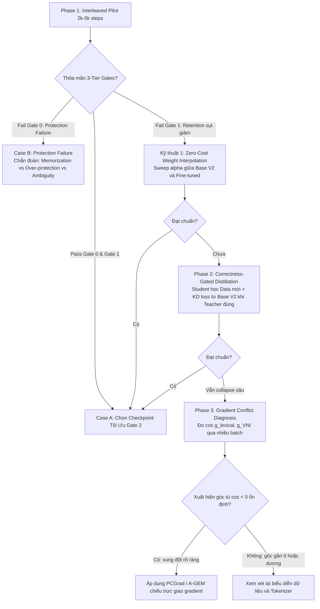

# Thiết kế Kiến trúc Pipeline Mới: Interleaved Continual Fine-Tuning ReparoS

**Bài toán:** Huấn luyện Fine-tuning mô hình ReparoS Base V2 (~6.6M tham số, 2 Enc – 1 Dec, FFN 2048) giải quyết đồng thời năng lực từ vựng mới (Plasticity), bảo toàn năng lực nền tảng (Capability Retention), và chống sửa sai các thực thể/câu sạch hợp lệ (Hard No-Change Protection).  
**Văn bản:** Đặc tả kỹ thuật & Bản thiết kế thực nghiệm (Technical Architecture & Experiment Specification).  
**Ngày lập:** 21/09/2026  
**Trạng thái:** Approved Architecture Specification (Thay thế hoàn toàn kiến trúc Curriculum V2 cũ).

---

## 1. Bản chất sự chuyển đổi mô hình (Paradigm Shift)

Sequential staged training là một giả thuyết chính (primary hypothesis) gây ra hiện tượng thoái hóa năng lực chọn lọc (selective negative transfer), do mức độ phơi nhiễm tác vụ (capability exposure) thay đổi quá mạnh giữa các stage; các artifact hiện tại không có intermediate checkpoints nên chưa đủ bằng chứng để xác lập cơ chế nhân quả chắc chắn. Kiến trúc mới chuyển dịch sang **Huấn luyện hòa trộn bảo toàn liên tục (Interleaved Continual Fine-Tuning)** như một thực nghiệm trực tiếp để kiểm chứng và khắc phục giả thuyết này:

```text
[Pipeline Mới]:
Base V2 Checkpoint (~6.6M)
        │
        ▼
Interleaved Capability Sampler (Bảo đảm tỷ lệ ngắn hạn trong mỗi 100 mẫu)
        │
        ├── Nhóm A (Plasticity Set - Cần học thêm): Address Abbrev / Contextual Acronym / Composition / User-Centric
        ├── Nhóm B (Capability Retention Set - Năng lực cũ cần giữ): VNI / Wrong Diacritic / Telex / Keyboard / Boundary / Missing Diacritics
        └── Nhóm C (Hard No-Change / Protection - Chống sửa sai): Brand Entities / Proper Nouns / Ambiguous Acronyms / Clean Queries
        │
        ▼
Short Trajectory Fine-Tuning (2.000 – 5.000 steps, checkpoint mỗi 250 steps)
        │
        ▼
Pairwise Regression Evaluation vs. Base V2 (Đo Gain, Lost, NetGain, FCR_seen, FCR_heldout, NoOpRate)
        │
        ▼
3-Tier Hierarchical Gate (Gate 0: Safety & Protection ──► Gate 1: Retention ──► Gate 2: Plasticity)
        │
    ┌───┴───┐
    ▼       ▼
 [PASS]   [FAIL] ──► Dừng ngay / Bác bỏ checkpoint (Không để model trôi dạt)
```

Sự khác biệt cốt lõi nằm ở **4 tầng kiến trúc**:

| Tầng kiến trúc | Curriculum V2 Cũ | Interleaved Continual Pipeline Mới |
| :--- | :--- | :--- |
| **1. Data** | Data mismatch (`d` $\rightarrow$ `đg`, thiếu `d.`/`đ.`); Trộn lẫn test set vào train templates | Chuẩn hóa Data Spec trước khi train; Phân định rõ Seen Knowledge vs. Held-out Identity; Nhóm C phân định Seen vs Held-out |
| **2. Sampling** | Phân chia stage tách biệt; Trọng số gán đều theo trực giác | Interleaved Sampler 3 nhóm tác vụ rõ rệt; Trọng số dựa trên rủi ro thực nghiệm từ Contingency Matrix |
| **3. Objective** | Cực đại hóa Accuracy tổng thể ($\max \text{Acc}$) | Tối ưu hóa 3 tầng: Gate 0 (Safety / FCR & NoOp) $\rightarrow$ Gate 1 (Retention) $\rightarrow$ Gate 2 ($\max \text{Gain}_{\text{primary}}$) |
| **4. Evaluation** | Đo độc lập từng stage; Gating cục bộ ở cuối stage | Đánh giá so sánh cặp liên tục (Pairwise vs. Base V2) qua $G, L, \text{NetGain}, FCR_{\text{seen}}, FCR_{\text{heldout}}, \text{NoOpRate}$; Chốt chặn mỗi 250 bước |

---

## 2. Tầng dữ liệu & Chuẩn hóa đặc tả (Data Specification Rectification)

### 2.1. Chuẩn hóa ngữ nghĩa `address_abbreviation` trước khi train

Thực nghiệm phân tích Contingency Matrix chứng minh hiện tượng sụt giảm `address_abbreviation` ở Curriculum cũ (91.12% $\rightarrow$ 39.62%) là do **Data/Task Mismatch** (tập sinh thiếu mapping `d` $\rightarrow$ `đường`), hoàn toàn khác với hiện tượng sụt giảm VNI (88.42% $\rightarrow$ 48.06%) vốn là catastrophic forgetting thực sự. Do đó, phải chuẩn hóa ngữ nghĩa chính xác trong generator trước khi tiến hành huấn luyện:

* **Danh mục tiền tố hành chính chuẩn:**
  * `d.` / `đ.` / `d ` / `đ ` $\rightarrow$ `đường ` (khi đi kèm tên riêng hoặc số nhà).
  * `tx.` / `tx ` $\rightarrow$ `thị xã `.
  * `tp.` / `tp ` $\rightarrow$ `thành phố `.
  * `q.` / `q ` / `q` + số $\rightarrow$ `quận ` (ví dụ `q1` $\rightarrow$ `quận 1`, `q.bt` $\rightarrow$ `quận bình thạnh`).
  * `p.` / `p ` / `p` + số $\rightarrow$ `phường ` (ví dụ `p2` $\rightarrow$ `phường 2`, `p.bn` $\rightarrow$ `phường bến nghé`).
* **Nguyên tắc ranh giới:** Nếu một mapping tiền tố chưa thống nhất được ngữ nghĩa hoặc context còn mập mờ, **tạm thời loại bỏ nhóm đó khỏi Acceptance Gate**, tuyệt đối không để mô hình chạy theo một benchmark mà dữ liệu huấn luyện không hỗ trợ.

### 2.2. Phân tách tập Acronym: Seen Knowledge vs. Held-out Evaluation

Không lặp lại sai lầm của Curriculum cũ (học thuộc 7 từ viết tắt cứng rồi benchmark lại hỏi đúng 7 từ đó). Bộ đánh giá năng lực từ vựng phải phân loại thành 4 tầng rõ ràng:

1. **Unseen Template:** Mapping đã học (`ltk` $\rightarrow$ `lý thường kiệt`), nhưng đặt trong cấu trúc ngữ pháp mới (`ở đoạn ltk giao với...`).
2. **Unseen Corruption:** Mapping đã học, nhưng gõ kèm lỗi phím/bộ gõ mới (`truowngf ltk`, `d. ltkq10`).
3. **Unseen Compositional Use:** Viết tắt kết hợp dính từ và gõ thiếu dấu (`duongltkquan1`).
4. **Truly Unseen Lexical Identity:** Từ viết tắt hoàn toàn mới mà mô hình chưa từng thấy trong train.
   * *Lưu ý phương pháp luận:* Một từ viết tắt trơ trọi như `ltk` bản chất là ánh xạ quy ước (arbitrary mapping). Không thể kỳ vọng mô hình "thần giao cách cảm" đoán đúng 100% các từ thuộc nhóm 4 nếu ngữ cảnh không cung cấp đủ thông tin. Nhóm 4 chỉ đánh giá xem mô hình có bảo toàn an toàn (No-op) hay bị hallucination bịa đặt.

---

## 3. Tầng lấy mẫu hòa trộn (Interleaved Capability Sampler)

### 3.1. Phân định ranh giới: 3 Nhóm tác vụ (Plasticity vs. Capability Retention vs. Hard No-Change)

Mọi mẫu dữ liệu trong quá trình huấn luyện và kiểm định được phân loại tường minh thành **3 nhóm độc lập** thay vì gom chung:

```text
A. PLASTICITY — Năng lực mới cần học thêm
   ├─ address abbreviation (tiền tố địa chỉ chuẩn: d., q., tp., tx., p.)
   ├─ contextual acronym (từ viết tắt có ngữ cảnh)
   ├─ composition (ghép lỗi phức hợp, dính từ + gõ sai)
   └─ user-centric (phân phối truy vấn người dùng thực tế)

B. CAPABILITY RETENTION — Năng lực nền tảng cũ cần giữ vững
   ├─ VNI (rò rỉ mã số: truong2, hoa1)
   ├─ wrong_diacritic (sai dấu thanh: hỏi, ngã, sắc, huyền, nặng)
   ├─ Telex (kẹt phím bộ gõ: truowngf)
   ├─ keyboard_edit (lỗi phím lân cận)
   ├─ boundary (dính/tách từ cơ bản)
   └─ missing_diacritics (thiếu dấu tiếng Việt cơ bản)

C. HARD NO-CHANGE / FALSE-CORRECTION PROTECTION — Chống sửa sai câu hợp lệ & Hard Negatives
   ├─ brand/entity hợp lệ (tên nhãn hàng, thương hiệu)
   ├─ proper noun hợp lệ (tên riêng, địa danh, tên người)
   ├─ ambiguous acronym (từ viết tắt mơ hồ/đa nghĩa thiếu ngữ cảnh)
   ├─ clean query (câu tiếng Việt sạch 100% không cần sửa)
   └─ hard negative cases (các từ viết hoa, thuật ngữ kỹ thuật)
```

**Ví dụ minh họa Nhóm C (Hard No-Change):**

| Input Query | Target Output | Trạng thái đánh giá | Ghi chú |
| :--- | :--- | :--- | :--- |
| `BV Bank` | `BV Bank` | $\checkmark$ ĐÚNG | Brand entity hợp lệ $\rightarrow$ Phải giữ nguyên |
| `Starbucks` | `Starbucks` | $\checkmark$ ĐÚNG | Tên thương hiệu quốc tế $\rightarrow$ Phải giữ nguyên |
| `Vincom` | `Vincom` | $\checkmark$ ĐÚNG | Tên riêng hợp lệ $\rightarrow$ Phải giữ nguyên |
| `BV Bank` | `bệnh viện Bank` | $\chi$ **FALSE CORRECTION** | **Mô hình bị over-aggressive (sửa sai phá hoại)** |

* **Bản chất của Nhóm C (Không phải Blacklist để học vẹt):**
  Dữ liệu bảo vệ Nhóm C **tuyệt đối không phải là một danh sách đen (blacklist) để mô hình học thuộc lòng (memorize)**. Mục tiêu cốt lõi của Nhóm C là giúp mô hình học được **ranh giới nhạy cảm với ngữ cảnh giữa SỬA ĐỔI và KHÔNG SỬA ĐỔI (Context-sensitive EDIT / NO-EDIT boundary)**, biết dựa vào ngữ cảnh xung quanh để quyết định một chuỗi ký tự có phải là lỗi hay là thực thể hợp lệ.

* **Phân định 2 tầng đánh giá cho Nhóm C (Seen vs. Held-out Protection):**
  Để đo lường khả năng học ranh giới thực sự, bộ kiểm định Nhóm C được chia tách thành hai tập độc lập:
  * **C1. Seen Protection:** Các pattern / thực thể đã có phơi nhiễm (exposure) trong tập huấn luyện (ví dụ các thương hiệu quen thuộc `Shopee`, `Vincom`).
  * **C2. Held-out Protection:** Các thực thể / pattern hoàn toàn mới, **chưa từng xuất hiện trong tập huấn luyện**, nhưng sở hữu hình thức bề mặt (surface form) rất dễ kích hoạt nhầm cơ chế sửa đổi của mô hình (ví dụ: tên viết tắt của một tổ chức mới, tên thương hiệu nước ngoài ít gặp).

### 3.2. Cấu hình trọng số lấy mẫu (Configurable Sampling Weights & Starting Prior)

Dựa trên Ma trận đối chứng (Contingency Matrix) từ 10.000 câu Diagnostic:
* `vni_leak`: Mất 364 câu, chỉ được 8 câu $\rightarrow$ **Cần bảo vệ cao (HIGH Protection)**.
* `wrong_diacritic`: Mất 201 câu, chỉ được 9 câu $\rightarrow$ **Cần bảo vệ cao (HIGH Protection)**.
* `telex_leak`: Mất 12 câu, được 12 câu $\rightarrow$ **Cân bằng tự nhiên (Lower Protection)**.
* `clean / hard-negative`: Mất 26 câu, được 34 câu $\rightarrow$ **Duy trì ổn định và chống sửa sai**.

Sampler được thiết kế theo dạng tham số hóa cấu hình (**Configurable Weights**), phân bổ đều đặn cho cả 3 nhóm:

```python
sampling_weights = {
    # Nhóm A: Plasticity Set (~30% - 35% khởi điểm)
    "lexical_prefix": 0.12,
    "acronym_contextual": 0.10,
    "composition_user": 0.13,
    
    # Nhóm B: Capability Retention Set (~45% - 50% khởi điểm)
    "vni_protected": 0.15,
    "wrong_diacritic_protected": 0.12,
    "missing_diacritics": 0.08,
    "keyboard_edit": 0.05,
    "telex": 0.05,
    "boundary": 0.03,

    # Nhóm C: Hard No-Change / Protection (~15% - 20% khởi điểm)
    "brand_entity_protect": 0.05,
    "proper_noun_protect": 0.04,
    "ambiguous_acronym_protect": 0.03,
    "clean_query_preservation": 0.05,
}
```

*Lưu ý phương pháp luận:* Các con số trên chỉ là điểm xuất phát thực nghiệm (starting prior) dựa trên mức độ rủi ro tương đối của ma trận đối chứng, không phải công thức bất biến.

### 3.3. Cơ chế bảo đảm phơi nhiễm liên tục (Continuous Rehearsal & Quota Semantics)

Tránh cách làm cũ: "tạo file 1 triệu dòng với tỷ lệ tĩnh rồi shuffle ngẫu nhiên toàn cục". Sampler hỗ trợ tham số `window_quota` (tùy chọn) để bảo đảm mức độ phơi nhiễm tác vụ bảo vệ:

* **Phân biệt động học Gradient giữa Mini-Batch Quota và Window Quota:**
  * **Mini-batch Quota:** Ép buộc trong *từng batch cập nhật* phải có đủ đại diện của từng tác vụ. Điều này trực tiếp trộn các vector gradient trong mỗi bước optimizer step.
  * **Window Quota (ví dụ trong 100 mẫu liên tiếp):** Bảo đảm tần suất xuất hiện vĩ mô trên một đoạn ngắn của quỹ đạo, nhưng nếu kích thước batch nhỏ, các optimizer step riêng lẻ vẫn có thể tạm thời không chứa mẫu VNI.
* **Bản chất kỹ thuật:** Cơ chế đưa mẫu lặp lại liên tục này bản chất là **tập dượt liên tục / phơi nhiễm tác vụ bảo vệ (continuous rehearsal / protected-task exposure)** để tạo ra rehearsal gradient, không phải là một "gradient regularizer" theo nghĩa giải tích toán học. Cần phân định rõ để không nhầm lẫn với các kỹ thuật ràng buộc gradient như EWC hay PCGrad.

---

## 4. Tầng đánh giá so sánh cặp & Tối ưu hóa có ràng buộc 3 tầng

### 4.1. Hàm mục tiêu chấp thuận 3 tầng (Gate 0 — False-Correction Protection)

Chuyển từ việc cực đại hóa độ chính xác tổng thể sang bài toán tối ưu hóa ràng buộc theo cấp bậc phân tầng:

$$\max \quad G_{\text{primary}}$$

$$\text{subject to} \quad \begin{cases} 
FCR_{\text{seen}} \le \tau_{\text{seen}} & (\text{Gate 0: SAFETY / Seen Protection}) \\
FCR_{\text{heldout}} \le \tau_{\text{heldout}} & (\text{Gate 0: SAFETY / Held-out Generalization}) \\
\Delta \text{NoOpRate}_{\text{edit\_required}} \le \mu_{\text{noop}} & (\text{Gate 0: SAFETY / Anti-Conservatism Budget}) \\
L_c \le \epsilon_c \quad \forall c \in \text{Retention} & (\text{Gate 1: RETENTION}) \\
\Delta G_p \ge -\delta_p \quad \forall p \in \text{Plasticity} \setminus \{\text{primary}\} & (\text{Gate 2: PLASTICITY})
\end{cases}$$

**Sơ đồ quyết định 3 tầng (Hierarchical Gating Pipeline):**

```text
Gate 0 — FALSE-CORRECTION PROTECTION & SAFETY
1. FCR_seen <= tau_seen? (Đã nhớ ranh giới bảo vệ trên tập đã học?)
2. FCR_heldout <= tau_heldout? (Có khái quát hóa ranh giới NO-EDIT sang thực thể lạ?)
3. NoOpRate_edit_required không tăng thoái hóa quá budget? (Có bị lười sửa / shortcut copy input?)
        │
       FAIL ──► Bác bỏ ngay checkpoint, không đánh giá tiếp
        │
       PASS
        ▼
Gate 1 — RETENTION
VNI / wrong_diacritic / Telex / ... có thoái hóa quá ngân sách? (L_c <= epsilon_c)
        │
       FAIL ──► Bác bỏ checkpoint
        │
       PASS
        ▼
Gate 2 — PLASTICITY
Học thêm được bao nhiêu? (max G_primary, đồng thời Delta G_p >= -delta_p)
        │
        ▼
Chọn checkpoint tốt nhất trong vùng khả thi (Feasible Region)
```

* **Nguyên tắc xác lập ngưỡng (Empirical Baseline Principle):**
  Các giá trị ngưỡng $\tau_{\text{seen}}, \tau_{\text{heldout}}, \mu_{\text{noop}}, \epsilon_c$ **tuyệt đối không được hardcode chủ quan khi chưa có dữ liệu thực nghiệm (evidence)**. Trong đợt chạy Pilot đầu tiên (Experiment 1), ta sẽ đo đạc chính xác các chỉ số này trên mô hình gốc Base V2 và theo dõi quỹ đạo dao động tự nhiên qua các checkpoint để làm căn cứ xác lập baseline / budget thực nghiệm vững chắc cho các vòng sau.
* **Quy tắc ngưỡng không khoan nhượng (Zero-Tolerance Rule):** Nếu yêu cầu kinh doanh thực tế đòi hỏi zero tolerance đối với các lỗi làm hỏng tên thương hiệu đối tác hoặc tên riêng (như `BV Bank` $\rightarrow$ `bệnh viện Bank`), ta thiết lập $\tau_{\text{seen\_brand}} = 0$ cho riêng lớp đó. Không cần và không nên mặc định $\tau = 0$ cho toàn bộ các mẫu clean thông thường, tránh làm tê liệt khả năng thích nghi của mô hình.
* $G_{\text{primary}}$ có thể là $G_{\text{address\_abbrev}}$ hoặc $G_{\text{user\_centric}}$ tùy mục tiêu trọng tâm của sprint.
* Ràng buộc $\Delta G_p \ge -\delta_p$ bảo đảm không có bất kỳ năng lực Plasticity nào bị hy sinh ngầm sau lưng năng lực chính.

### 4.2. Bộ ba chỉ số chuyên biệt: False Correction Rate & No-Op Rate

Không dừng lại ở việc đo clean accuracy chung chung. Để bóc tách rành mạch cơ chế học và phân biệt rõ giữa **khái quát hóa (generalization)**, **học vẹt (memorization)** và **bảo vệ quá đà (over-protection)**, hệ thống thiết lập bộ ba chỉ số đánh giá chuyên biệt:

1. **$FCR_{\text{seen}}$ (Seen False Correction Rate):**
   Tỷ lệ sửa sai trên các mẫu bảo vệ đã có exposure trong tập huấn luyện:
   $$FCR_{\text{seen}} = \frac{\#\text{Seen no-change samples bị thay đổi sai}}{\#\text{Seen no-change samples}}$$

2. **$FCR_{\text{heldout}}$ (Held-out False Correction Rate):**
   Tỷ lệ sửa sai trên các thực thể/mẫu bảo vệ hoàn toàn held-out (chưa từng thấy trong train):
   $$FCR_{\text{heldout}} = \frac{\#\text{Held-out no-change samples bị thay đổi sai}}{\#\text{Held-out no-change samples}}$$

3. **$\text{NoOpRate}_{\text{edit\_required}}$ (Tỷ lệ bỏ qua trên tập cần sửa):**
   Trong số những câu thực sự có lỗi và bắt buộc phải sửa (editing required), bao nhiêu % mô hình lại copy nguyên xi input mà không sửa:
   $$\text{NoOpRate}_{\text{edit\_required}} = \frac{\#\text{Edit-required samples có output } \equiv \text{ input}}{\#\text{Edit-required samples}}$$

**Ý nghĩa chẩn đoán phân biệt 3 hiện tượng thất bại (Failure Modes):**

| Biến thiên Metric | Hiện tượng nhận diện | Bản chất & Ý nghĩa chẩn đoán |
| :--- | :--- | :--- |
| $FCR_{\text{seen}} \downarrow, \ FCR_{\text{heldout}} \downarrow$ | **Khái quát hóa ranh giới (Generalization)** | Protection thực sự cải thiện. Mô hình học được ranh giới context-sensitive EDIT / NO-EDIT ngay cả trên các từ ngữ lạ. |
| $FCR_{\text{seen}} \downarrow, \ FCR_{\text{heldout}}$ không $\downarrow$ | **Học vẹt danh sách (Memorization)** | Mô hình chỉ học thuộc lòng danh sách entity trong train; gặp thực thể lạ có hình thái tương tự là sửa sai. |
| $FCR \downarrow$ nhưng $\text{NoOpRate}_{\text{edit\_required}} \uparrow$ mạnh | **Bảo vệ quá đà / Quá nhút nhát (Over-protection)** | Mô hình học "đường tắt" (shortcut) copy input để né phạt sửa sai, dẫn đến mất khả năng sửa các câu có lỗi thực sự. |

Đồng thời, hệ thống tiếp tục theo dõi phân rã đa chiều theo loại thực thể: $FCR_{\text{brand}}$, $FCR_{\text{proper\_noun}}$, $FCR_{\text{ambiguous\_abbrev}}$, $FCR_{\text{clean\_query}}$ cùng trạng thái chuyển dịch `No-change` $\rightarrow$ `No-change` (Good) vs. `No-change` $\rightarrow$ `Changed wrong` (False Correction).

### 4.3. Metric so sánh cặp & Phân tích ma trận chuyển dịch (Per-Capability Pairwise Metrics)

Mỗi candidate checkpoint được so sánh trực tiếp theo từng cặp mẫu với **Base V2 gốc**:
* $G_k$ (Gain của task $k$): Số câu Base V2 sai $\rightarrow$ Candidate sửa đúng.
* $L_k$ (Lost của task $k$): Số câu Base V2 đúng $\rightarrow$ Candidate làm sai.
* $\text{NetGain}_k = G_k - L_k$.

**Nguyên tắc nghiệm thu (Acceptance Rule):**
Không dùng $\text{NetGain}$ tổng thể làm tiêu chuẩn quyết định vì một giá trị tổng dương có thể che giấu sự sụp đổ nghiêm trọng ở một tác vụ bảo vệ hoặc một nhánh plasticity (ví dụ: Lexical $+300$, nhưng Composition $-80$, VNI $-10$, Keyboard $-40$). Do đó:
* **Tiêu chuẩn nghiệm thu chính (Primary Criterion):** Vượt qua tuần tự Gate 0, Gate 1 và tối ưu Gate 2.
* **$\text{NetGain}$ tổng thể chỉ là chỉ số tóm tắt thứ cấp (Secondary Summary Metric)**.

### 4.4. Đánh giá tần suất cao & Lựa chọn trên tập Pareto (Pareto-Constrained Selection)

* Không đợi train xong toàn bộ mới đánh giá.
* Huấn luyện bước ngắn: **2.000 – 5.000 steps**.
* Cứ mỗi **250 – 500 steps**, tự động kích hoạt bộ probe đánh giá nhanh trên các tập con kiểm định.
* **Quy trình chọn Checkpoint tối ưu:**
  1. **Bước 1 (Lọc cứng qua Gate 0 & Gate 1):** Loại bỏ toàn bộ các checkpoint vi phạm Gate 0 hoặc Gate 1.
  2. **Bước 2 (Cực đại hóa mục tiêu ở Gate 2):** Trong số các candidate lọt vào vùng khả thi, chọn checkpoint có mức tăng năng lực mục tiêu lớn nhất ($\max G_{\text{primary}}$).

---

## 5. Các pha kỹ thuật nâng cao (Contingency Fallback Phases)

Nếu phương pháp Interleaving thuần túy chưa đủ để triệt tiêu hoàn toàn hiện tượng thoái hóa, hệ thống sẽ kích hoạt lần lượt 3 công cụ kỹ thuật theo thứ tự từ chi phí thấp đến chi phí cao:



### 5.1. Công cụ 0 đồng: Nội suy trọng số (Weight Interpolation / Model Soups)

Không cần train lại, áp dụng phép nội suy tham số trực tiếp giữa Base V2 gốc ($\theta_0$) và candidate checkpoint vừa fine-tune ($\theta_1$):

$$\theta_\alpha = (1 - \alpha)\theta_0 + \alpha\theta_1, \quad \alpha \in \{0.2, 0.4, 0.6, 0.8\}$$

* **Nguyên tắc phương pháp luận:** Không phỏng đoán trước giá trị $\alpha$ nào là tối ưu khi chưa có số liệu thực nghiệm ReparoS. Toàn bộ các giá trị $\alpha$ sẽ được sweep và đánh giá thực nghiệm (empirical evaluation) trên các probe kiểm định để xác định đường cong đánh đổi thực tế.

### 5.2. Phase 2: Chưng cất tri thức có chọn lọc (Correctness-Gated Distillation)

Khi cần khóa chặt hành vi của Base V2, đóng băng một bản copy $\text{Base V2}$ làm Teacher, mô hình fine-tune làm Student:

$$\mathcal{L}_{\text{total}} = \mathcal{L}_{\text{supervised}} + \lambda \cdot \mathbb{I}(\text{Teacher is Correct}) \cdot \mathcal{L}_{\text{KD}}(P_{\text{student}}, P_{\text{teacher}})$$

* **Điểm then chốt (Correctness-Gated):** Chỉ phạt loss chưng cất ($\mathcal{L}_{\text{KD}}$) tại những mẫu mà Base V2 **đang làm đúng**. Tuyệt đối không chưng cất tại những câu Base V2 làm sai (ví dụ `d tỉnh 768` $\rightarrow$ `đ tỉnh 768`), để Student không bị ép học lại điểm yếu của Teacher.

### 5.3. Phase 3: Chẩn đoán và triệt tiêu xung đột Gradient (Gradient Conflict & PCGrad)

Chỉ triển khai khi có bằng chứng suy thoái sâu dù đã có Replay và Distillation:
1. Tính tích vô hướng cosine giữa các vector gradient tác vụ:
   $$\rho = \cos(g_{\text{lexical}}, g_{\text{VNI}}) = \frac{g_{\text{lexical}} \cdot g_{\text{VNI}}}{\|g_{\text{lexical}}\| \|g_{\text{VNI}}\|}$$
2. Nếu xuất hiện góc tù $\rho < 0$ lặp lại ổn định qua nhiều batch (gradient của từ viết tắt trực tiếp chống lại gradient của VNI):
   * Áp dụng thuật toán **PCGrad (Projecting Conflicting Gradients)**: Khi $g_i \cdot g_j < 0$, chiếu vector $g_i$ lên mặt phẳng trực giao với $g_j$:
     $$g_i \leftarrow g_i - \frac{g_i \cdot g_j}{\|g_j\|^2} g_j$$
   * *Lưu ý kỹ thuật:* PCGrad chỉ thực hiện phép chiếu triệt tiêu các thành phần gradient đối kháng trực tiếp theo công thức giải tích; kỹ thuật này làm giảm thiểu can thiệp phá hủy (destructive interference) nhưng không bảo đảm toán học 100% loại bỏ hoàn toàn hồi quy.

---

## 6. Kế hoạch chạy Thử nghiệm 1 (Experiment 1 Execution Plan)

### 6.1. Cấu hình thử nghiệm & Lăng kính chẩn đoán Arm A / Arm B

* **Mô hình khởi tạo:** `artifacts/reparos-base-v2-32-final-1/reparos_base_v2_step_10000.pt` (2 Enc – 1 Dec, FFN 2048, hidden 128, heads 8).
* **Số bước huấn luyện:** 3.000 steps ban đầu (mục tiêu pilot thăm dò quỹ đạo, không chạy dài).
* **Cơ chế lấy mẫu:** Interleaved Capability Sampler 3 nhóm (Mục 3.2).
* **Hàm mất mát:** **Standard Cross-Entropy thuần túy**. Chưa thêm weighted penalty hay hàm loss đặc biệt trước khi có evidence thực nghiệm.
* **Thiết lập 2 nhánh tốc độ học (Controlled Learning Rate Arms):**
  Kiểm toán tệp `artifacts/reparos-base-v2-32-final-1/opennmt-base-v2.json` ghi nhận Base V2 được huấn luyện bằng Noam schedule (`learning_rate: 1.0`, `decay_method: "noam"`, `warmup_steps: 1000`, `hidden_size: 128`), kết thúc tại Step 10.000 với tốc độ học hiệu dụng đạt xấp xỉ $8.8 \times 10^{-4}$. Trên cùng checkpoint Base V2, cùng tập dữ liệu, cùng cơ chế lấy mẫu Interleaved, Experiment 1 đối sánh 2 nhánh:
  * **Arm A (Exact Noam Continuation - Control/Reference Branch):** Tiếp tục quỹ đạo Noam kế thừa từ Base V2 (bắt đầu từ Step 10.001 đến 13.000, $LR_{\text{effective}} \approx 8.8 \times 10^{-4} \rightarrow 7.2 \times 10^{-4}$). Nhánh này trả lời câu hỏi: *"Nếu tiếp tục giữ nguyên hành vi optimizer/LR của Base V2 thì chuyện gì xảy ra?"*
  * **Arm B (Conservative Scaled Low-LR - Low Magnitude Branch):** Thiết lập $LR \approx 5.0 \times 10^{-5} - 8.8 \times 10^{-5}$ (tương đương $\approx 1/10$ của Arm A) với Warmup ngắn (250–500 steps) và Cosine Decay.
* **Vai trò phương pháp luận của Arm A/B:** Arm A và Arm B **không còn là trung tâm của việc định nghĩa case**, mà đóng vai trò là **công cụ chẩn đoán (diagnostic lens)** giúp giải thích nguyên nhân và bản chất khi các kịch bản thực nghiệm xảy ra.

### 6.2. Phân loại kết quả: 4 Kịch bản tổng quát (4 General Experimental Outcomes)

Sau khi quét các checkpoint qua hệ thống kiểm định 3 tầng, toàn bộ kết quả của Experiment 1 được phân loại thành 4 kịch bản tổng quát:

#### CASE A — SUCCESS / FEASIBLE REGION (Thành công trong vùng khả thi)
* **Dấu hiệu:** Xuất hiện ít nhất một checkpoint thỏa mãn đồng thời:
  * $\checkmark$ **Gate 0 (Safety & Protection):** $FCR_{\text{seen}} \le \tau_{\text{seen}}$, $FCR_{\text{heldout}} \le \tau_{\text{heldout}}$, $\Delta \text{NoOpRate}_{\text{edit\_required}} \le \mu_{\text{noop}}$.
  * $\checkmark$ **Gate 1 (Retention):** $L_c \le \epsilon_c \quad \forall c \in \text{Retention}$ (Năng lực cũ VNI, wrong-dia, Telex được giữ vững).
  * $\checkmark$ **Gate 2 (Plasticity):** $G_{\text{primary}} \uparrow$ vượt trội, đồng thời không có năng lực phụ nào bị hy sinh ($\Delta G_p \ge -\delta_p$).
* **Kết luận & Hành động:** Pipeline đạt mục tiêu đề ra. Chọn checkpoint có $G_{\text{primary}}$ cao nhất trong vùng khả thi để triển khai hoặc làm mốc baseline mới.

#### CASE B — PROTECTION FAILURE (Thất bại ở chốt chặn bảo vệ Gate 0)
* **Dấu hiệu:** Gate 0 FAIL (Xuất hiện hiện tượng sửa sai thực thể hoặc thoái hóa tỷ lệ No-Op).
* **Cơ chế chẩn đoán phân nhánh (Diagnostic Branches — Tuyệt đối không tự động tăng penalty):**
  * **Nhánh B1 ($FCR_{\text{seen}} \uparrow$):**
    $\rightarrow$ Mô hình thất bại ngay trên các mẫu đã có phơi nhiễm trong train.
    $\rightarrow$ **Hành động điều tra:** Kiểm tra lại exposure trong Interleaved Sampler, rà soát tỷ trọng Nhóm C (`sampling_weights`), và kiểm tra nhãn mâu thuẫn (contradictory labels trong data generator).
  * **Nhánh B2 ($FCR_{\text{seen}} \downarrow$ nhưng $FCR_{\text{heldout}}$ không $\downarrow$):**
    $\rightarrow$ Protection **không có khả năng khái quát hóa** (mô hình đang học vẹt danh sách entity trong train).
    $\rightarrow$ **Hành động điều tra:** Rà soát tính đa dạng ngữ cảnh (context diversity), bổ sung các mẫu có cấu trúc câu phong phú quanh thực thể; **tuyệt đối KHÔNG mặc định tăng loss penalty hay nhồi thêm tên entity vào tập train**.
  * **Nhánh B3 ($FCR \downarrow$ nhưng $\text{NoOpRate}_{\text{edit\_required}} \uparrow$ mạnh):**
    $\rightarrow$ **Hiện tượng bảo vệ quá đà (Over-protection)**: Mô hình học shortcut "copy input" để né phạt sửa sai, làm tê liệt khả năng sửa các câu có lỗi thực sự.
    $\rightarrow$ **Hành động điều tra:** Giảm nhẹ tỷ trọng Nhóm C, bổ sung các mẫu tương phản có context rõ ràng để kéo mô hình thoát khỏi trạng thái "nhút nhát".
  * **Nhánh B4 ($FCR_{\text{seen}} \downarrow + FCR_{\text{heldout}} \downarrow + \text{NoOpRate}_{\text{edit\_required}}$ ổn định):**
    $\rightarrow$ Chốt chặn bảo vệ thực sự cải thiện và khái quát hóa ranh giới EDIT / NO-EDIT thành công.

#### CASE C — SELECTIVE FORGETTING (Quên có chọn lọc năng lực nền tảng)
* **Dấu hiệu:** Gate 0 (Protection) vẫn ổn định, Plasticity tăng tốt, nhưng một số năng lực cũ trong Nhóm B bị suy thoái vượt ngân sách ($L_c > \epsilon_c$, **Gate 1 FAIL**; ví dụ VNI hoặc wrong_diacritic bị rơi).
* **Phân tích bản chất:** Xảy ra hiện tượng can thiệp tiêu cực chọn lọc (selective interference) giữa task mới và task cũ.
* **Hành động điều tra (Sử dụng lăng kính Arm A vs. Arm B):**
  1. Phân tích chi tiết capability-specific regression: xác định chính xác năng lực nào bị suy thoái mạnh nhất.
  2. **So sánh Arm A vs. Arm B để đánh giá vai trò của training update regime:**
     * Nếu Arm A bị sụt giảm mạnh trong khi Arm B giữ vững năng lực $\rightarrow$ Update regime (LR magnitude và schedule) có ảnh hưởng quyết định; ưu tiên chọn không gian cập nhật bảo thủ (nhánh B).
     * Nếu cả Arm A và Arm B đều suy giảm $\rightarrow$ Việc giảm LR đơn thuần là không đủ; xung đột nằm ở phân phối dữ liệu hoặc biểu diễn.
  3. Nếu điều chỉnh sampling weights của Nhóm B vẫn chưa giải quyết triệt để $\rightarrow$ Kích hoạt Phase 2 (Gated Distillation) hoặc Phase 3 (Đo góc $\cos(g_{\text{lexical}}, g_{\text{VNI}})$ để xác định gradient conflict).

#### CASE D — UNDER-LEARNING (Mô hình quá bảo thủ / Học không vào)
* **Dấu hiệu:** Gate 0 (Safety) $\checkmark$, Gate 1 (Retention) $\checkmark$, nhưng Plasticity hầu như không tăng ($G_{\text{primary}} \approx 0$).
* **Phân tích bản chất:** Mô hình quá bảo thủ, gradient của dữ liệu mới bị lấn át hoàn toàn bởi rehearsal data, hoặc tín hiệu học (learning signal) chưa đủ mạnh để kích hoạt cập nhật biểu diễn.
* **Hành động điều tra:**
  1. Xem xét lại Learning Rate: kiểm tra xem LR ở Arm B có bị quá thấp hoặc decay quá nhanh không (so sánh với trajectory của Arm A).
  2. Kiểm tra tỷ trọng lấy mẫu: Nhóm Plasticity có bị dilute quá mức không ($< 25\%$)?
  3. Kiểm tra tính biểu diễn của dữ liệu và Tokenizer: các token viết tắt mới có bị phân rã thành các sub-token rời rạc gây khó khăn cho việc biểu diễn hay không.

---

*Đặc tả này là baseline experimental specification; các hyperparameter và acceptance budget được version hóa và chỉ thay đổi dựa trên kết quả experiment hoặc production constraints.*
